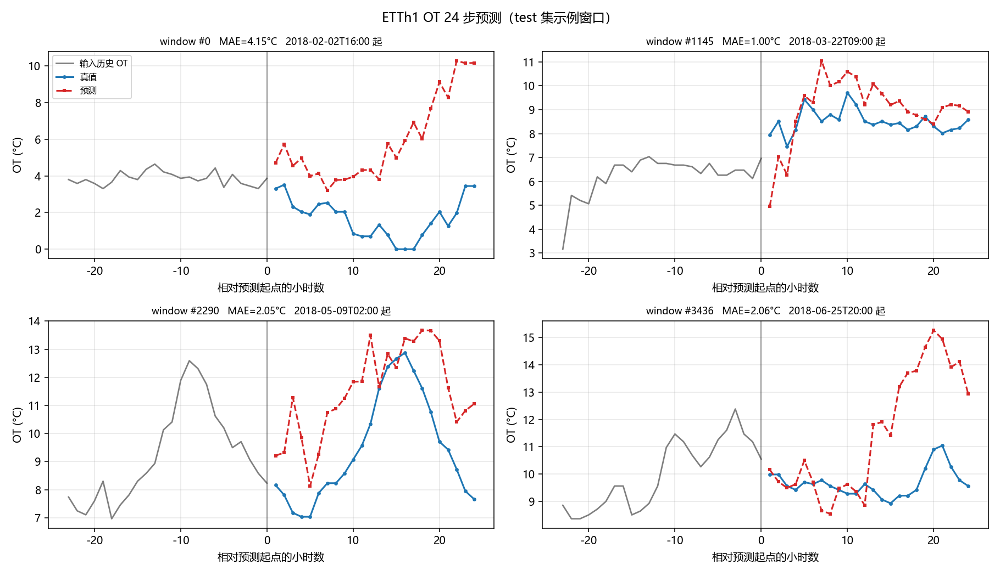
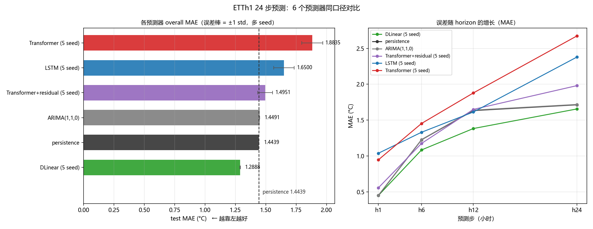
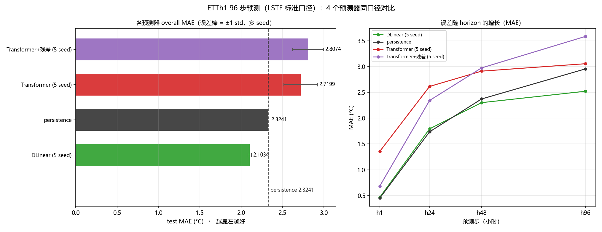
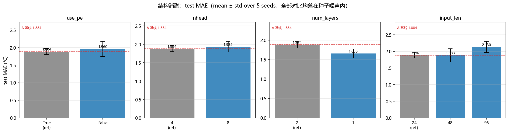
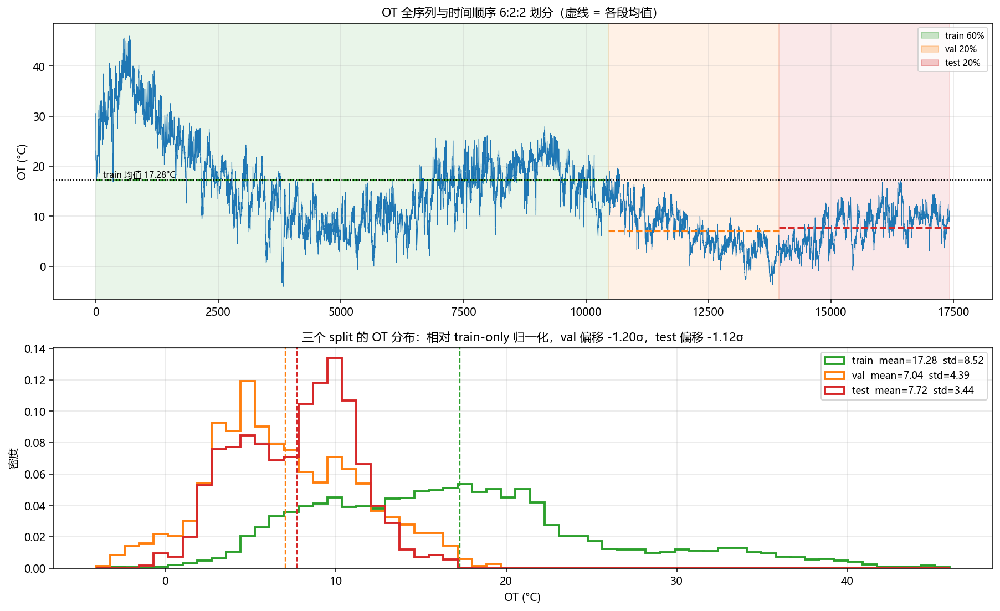
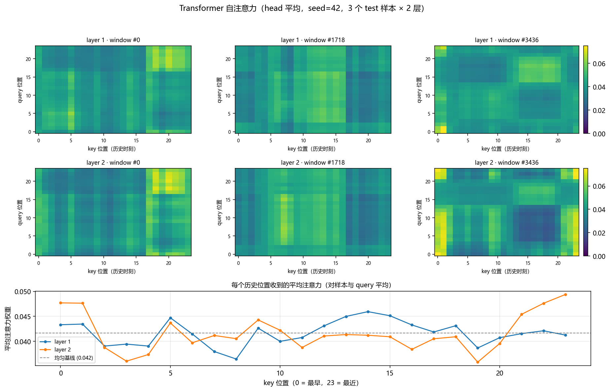
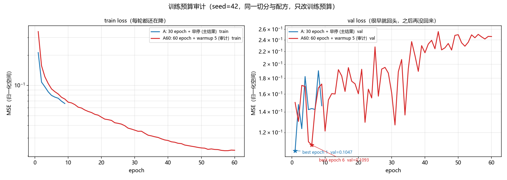
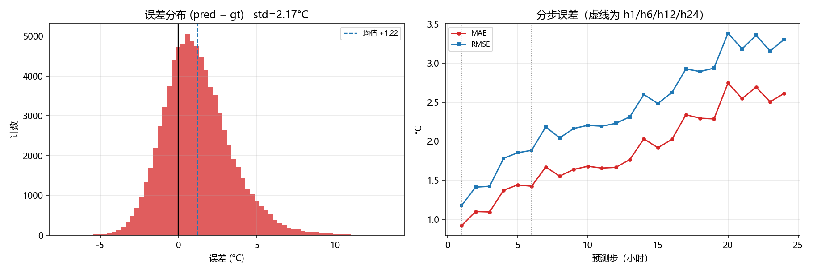

# 基于 Transformer 的多步时间序列预测系统（ETTh1）

项目维护者：[Guangming Zhou (周广明)](https://github.com/guangming-zhou)（GitHub：[@guangming-zhou](https://github.com/guangming-zhou)）。

**来源与许可**：[第三方声明](THIRD_PARTY_NOTICES.md) · [数据来源与 CC BY-ND 4.0](data/README.md)。
本项目的贡献是预测实验及工程实现；ETTh1 数据、DLinear 等已有方法和参考组件归原作者。
MIT 仅覆盖本项目有权授权的贡献，第三方内容保留其各自许可。
上传范围、验证结果与尚待确认的来源问题见 [发布前检查](docs/RELEASE_CHECK.md)。


正式实验使用过去 **96 小时**的观测预测未来 **96 小时**的 `OT`（油温），
采用 ETTh1 固定 12/4/4 月切分和原始数据。早期 24→24 与自定义 6:2:2 的
96→96 实验留在后文作为历史记录。

> **协议状态说明（重要）**：下方已有数值来自项目早期的自定义 6:2:2 协议，且当时在
> 完整序列上做了双向插值。它们作为实验历史保留，不能当作无前视的官方 LSTF 结果。
> 新增的 `configs/official_etth1_96.yaml` 使用官方固定 12/4/4 月边界、原始数据、无异常替换、
> 无 σ 裁剪；新的正式结论必须在该协议下重新生成。项目不是论文完整复现。
> 历史小节中的汇总命令需要旧实验的全部 checkpoint 和附带协议元数据；
> 下载后的精简仓库主要支持单个随附 checkpoint 的评估与新实验重训。
> 历史 ARIMA 指标曾用测试段前20个窗口的历史选阶；当前 `auto` 已改为验证段选阶，
> 因此历史 ARIMA 数值也只作旧实验记录，不能冒充修正后协议的结果。

正式任务：`x=(96,7)`，`y=(96,)`；DLinear-S 的目标输出只依赖 `OT` 历史，
LSTM 和 Transformer 使用七个变量。因此表格反映实际预测效果，不能直接作同输入的架构归因。

| 正式协议 96→96 | 输入 | MAE（°C） |
|---|---|---:|
| DLinear-S，5 seed | OT | **1.7346 ± 0.0274** |
| persistence | OT | 1.8654 |
| LSTM，5 seed | 7 变量 | 5.7098 ± 0.4259 |
| Encoder-only Transformer，5 seed | 7 变量 | 7.7954 ± 0.5850 |

完整 RMSE、配对置信区间和复现命令见下方
[官方原始协议结果](#官方原始协议结果96--96完整-5-seed)。

## 历史结果（自定义协议，先看限制）



ETTh1 的 OT，test 集 3437 个滑窗 × 24 步，单位摄氏度，随机模型取 5 seed 的 `mean ± std`：

| 模型 | 参数量 | MAE | vs persistence | 旧版稳定性阈值 |
|---|---|---|---|---|
| persistence | 0 | 1.4439 | — | 平凡基线（重复最后一步） |
| ARIMA(1,1,0) | — | 1.4491 | +0.0052 | 确定性算法，不参与判定 |
| **DLinear-S** | **1,200** | **1.2888 ± 0.0020** | **−0.1551** | 🟢 **超过旧阈值：唯一稳定跑赢 persistence 的模型** |
| LSTM | 53,528 | 1.6500 ± 0.0851 | +0.2061 | 🔴 超过旧阈值：差于 persistence |
| Transformer（本文模型） | 105,880 | 1.8835 ± 0.0861 | +0.4396 | 🔴 超过旧阈值：差于 persistence |
| Transformer + 残差头 | 105,880 | 1.4951 ± 0.0621 | +0.0512 | 未超过旧阈值；未证明与基线等效 |



左图：各预测器的 overall MAE（误差棒 = ±1 std），竖直虚线是 persistence ——
**只有 DLinear 落在线的左边**。右图：误差随 horizon 的增长，能看到 Transformer / LSTM
从 `h1` 起就整体偏高，而 DLinear 只在 `h1` 与 persistence 重合。

四条可以带走的结论：

1. **在该自定义协议下，参数更多没有带来更好结果。** 105,880 参数的 Transformer
   差于 persistence；1,200 参数的单变量 DLinear-S 优于 persistence（**−10.7%**）。
   「简单线性模型在 ETT 上打败 Transformer」是被反复报告过的现象，
   本项目用**自己的切分与判定流程**把它复现了出来。
2. **在旧协议下，加残差头能明显降低 Transformer 误差**
   （`delta = −0.3884`，`2σ = 0.1723`，相对原 Transformer 改善 **+20.6%**）。
   这是本项目唯一的正面模型改动，但它也只是把模型拉回平凡基线水平，
   而且**在 96 步上失效**（见第 3 条）。
3. **换到同一自定义协议的 96 到 96 后，两条观察都要改口径**：
   Transformer 的劣势变得**不可判定**（`delta = +0.3958`，`2σ = 0.4080`）—— 不是模型变好了，
   而是种子方差从 0.0861 暴涨到 **0.2040**（2.4 倍），**5 个 seed 仍全部差于 persistence**；
   而**残差头在这里失效**：`h1` 从 1.3551 砍到 0.6828，`h96` 却从 3.0549 恶化到 3.5845，
   overall 相对 A 的改善落在旧噪声阈值内，且仍差于 persistence。
   同一设定下只有 **DLinear-S 仍超过旧稳定性阈值（−9.5%）**。详见 96 到 96 小节。
4. 项目中段曾有一个「某配置改善 21%」的结论，5 seed 复核后被**推翻并撤回**。
   `2×max(σ)` 现在只保留为旧版稳定性启发式；统一汇总入口已改为固定完整 5 seed 的
   配对差值与 95% Student-t 置信区间，不再把旧阈值称为统计显著性检验。

## 30 秒上手

```bash
pip install -r requirements.txt

python -m utils.smoke_test        # 数据管道自检：清洗 / 切分 / 滑窗不变量
python -m pytest -q               # 发布副本：116 passed、1 skipped（历史 scaler96 未随附）
python eval/evaluate.py --ckpt outputs/ckpt/seed42.pt \
    --config configs/base.yaml --out outputs/figs      # 复现 seed42 的 test 指标
python -m demo.test_api           # Demo 契约自检（不需要起服务）
```

### 官方 ETTh1 原始数据协议（新的正式入口）

`configs/official_etth1_96.yaml` 使用固定 12/4/4 月边界：训练 8640 行、验证 2880 行、
测试 2880 行；验证和测试只向前借 96 行已观测上下文，评分目标严格位于各自 split 内。
配置关闭异常替换和 σ 裁剪，因此主评测不会把双向插值生成的值当作真实标签。

```bash
# 先生成仅由官方 train 段拟合的 scaler，并检查窗口数 8449 / 2785 / 2785
python -c "from utils.dataset import load_data_config,prepare_data; prepare_data(load_data_config('configs/official_etth1_96.yaml'))"

# 单次训练；正式多 seed 使用下方 sweep
python train/train.py --config configs/official_etth1_96.yaml --seed 42

python scripts/sweep.py --config configs/official_etth1_96.yaml \
  --out-root outputs/_runs/official96 --seeds 42 0 1 2 9999 --run transformer
```

旧配置 `base.yaml` / `lstf96.yaml` 保留用于复算历史实验，不再作为官方协议入口。

#### 官方原始协议结果（96 → 96，完整 5 seed）

测试集为 2785 个预测起点。数值单位为摄氏度，随机模型报告 `mean ± sample std`：

| 模型 | 实际输入 | MAE | RMSE | vs persistence 的配对差值（95% CI） |
|---|---|---:|---:|---:|
| persistence | OT | 1.8654 | 2.4151 | — |
| **DLinear-S** | **OT** | **1.7346 ± 0.0274** | **2.3482 ± 0.0359** | **−0.1308 [−0.1649, −0.0968]** |
| LSTM | 7 变量 | 5.7098 ± 0.4259 | 6.1899 ± 0.4104 | +3.8444 [+3.3155, +4.3732] |
| Encoder-only Transformer | 7 变量 | 7.7954 ± 0.5850 | 9.0548 ± 0.7643 | +5.9300 [+5.2036, +6.6563] |

这张表支持一个有限但可靠的结论：在当前官方原始数据协议和训练配方下，单变量
DLinear-S 稳定优于 persistence，而当前 LSTM 与 encoder-only Transformer 明显失败。
它**不证明** Transformer 模型整体不适合时间序列，也不能把 DLinear-S 描述成使用了全部
7 个变量。S/MS 公平对照仍应分开解释。机器可读明细见
`outputs/official96/head_to_head.json`。

Transformer 的 seed2 训练耗时异常（约 9.5 小时，而其余 seed 约 3–15 分钟），因此本次
运行的时间数据不用于模型效率结论；权重与指标仍通过独立 checkpoint 推理纳入准确率汇总。

仓库里**随代码分发了历史 24→24 的两个 ckpt 和 scaler**（共约 850 KB），
因此历史评估与 Demo 可直接运行。官方96→96的5 seed checkpoint 不随仓库发布；
其指标可查看 `outputs/official96/head_to_head.json`，完整现场推理需要按命令重训。

## 这个仓库里有什么

* **一条可审计的数据管道**：ETTh1 逐字节校验、三条分级清洗规则、train-only 归一化，
  每一步都落盘可复算（`utils/dataset.py`、`utils/smoke_test.py`）。
* **同一口径下的 6 个预测器**：persistence / ARIMA / LSTM / DLinear / Transformer /
  Transformer+残差 —— 同一份 test 滑窗、同一份 `outputs/scaler.npz`、
  同一个 `utils/metrics.compute_metrics`。唯一汇总入口是 `eval/head_to_head.py`。
* **完整 5 seed + 配对置信区间**，以及旧启发式如何**推翻单 seed 结论**的完整记录
  （`## 报告口径：多 seed 规范`、`## Multi-Seed Verification`）。
* **失败与调试的诚实记录**：评估脚本漏 `load_state_dict` 导致评估的是随机模型、
  单 seed 结论不可复现、`val_loss` 口径造成的错觉（`## 调试经验`）。
* **可跑的最小 Demo**（FastAPI + Streamlit）+ **GitHub Actions CI**
  （Python 3.10 / 3.12 上运行 117 个单测，并断言随仓库分发的 ckpt 能复现 README 指标）。

## 文档地图


| 我想… | 看这里 |
|---|---|
| 直接看新协议结果 | [`官方 ETTh1 原始数据协议`](#官方-etth1-原始数据协议新的正式入口) |
| 判断这个仓库值不值得看 | [`这个仓库里有什么`](#这个仓库里有什么) · [`已知限制与后续方向`](#已知限制与后续方向) |
| 跑起来 | [`30 秒上手`](#30-秒上手) · [`Requirements & Quickstart`](#requirements--quickstart) · [`目录结构`](#目录结构) |
| 复现某个数字 | [`官方 ETTh1 原始数据协议`](#官方-etth1-原始数据协议新的正式入口) · [`已知限制与后续方向`](#已知限制与后续方向) |
| 换成自己的数据 | [`换一份数据`](#换一份数据) |
| 检查代码质量 / 测试 | [`测试`](#测试) · [`Reproducibility`](#reproducibility) |
| 看失败与撤回的记录 | [`Multi-Seed Verification: A vs G4`](#multi-seed-verification-a-vs-g4) · [`调试经验`](#调试经验) · [`已知限制与后续方向`](#已知限制与后续方向) |

**逐节索引**

* **结果**
  * [`Legacy Main Results`](#legacy-main-results历史自定义协议) —— 旧协议结果，仅作历史记录
  * [`DLinear-S：历史 24→24 结果`](#dlinear-s历史-2424-结果)
  * [`Residual-Prediction Fix`](#residual-prediction-fix) —— 历史实验中残差头降低了 Transformer 误差
  * [`自定义 6:2:2 协议下的 96 到 96 历史实验`](#自定义-622-协议下的-96-到-96-历史实验)
  * [`Baselines 对比汇总`](#baselines-对比汇总) · **Evaluation（test 集）** —— seed42 单跑明细与管线验证
* **实验台账（含被否掉的假设）**
  * [`历史报告口径：多 seed 2σ 启发式`](#历史报告口径多-seed-2σ-启发式)
  * [`Ablation Study (5 seeds)`](#ablation-study-5-seeds) ·
    **Ablations: Capacity / Tuning / Window Redundancy**（单 seed 台账，已被多 seed 复核否掉）
  * [`Multi-Seed Verification: A vs G4`](#multi-seed-verification-a-vs-g4) —— 撤回「改善 21%」的完整过程
  * [`Distribution Shift Observation`](#distribution-shift-observation) ·
    [`Control Experiment: Season-Stratified Split`](#control-experiment-season-stratified-split)
  * [`Attention Visualization`](#attention-visualization) · [`训练预算审计`](#训练预算审计)
* **数据与模型**
  * [`数据探查结论`](#数据探查结论) · [`清洗与预处理策略`](#清洗与预处理策略)
  * [`模型`](#模型) · [`训练`](#训练)
* **工程**
  * [`测试`](#测试) · [`Reproducibility`](#reproducibility) · [`Demo`](#demo)
  * [`调试经验`](#调试经验) · [`进度`](#进度) · [`已知限制与后续方向`](#已知限制与后续方向)


## Legacy Main Results（历史自定义协议）


在 ETTh1 的 OT 上做 24 步多步预测，test 集 3437 滑窗，单位**摄氏度**。
所有行都在同一份 test 滑窗、同一份 `outputs/scaler.npz`、同一个
`utils/metrics.compute_metrics` 下评测；复现命令见本节末尾。

| 模型 | 参数量 | MAE | RMSE | h1 | h6 | h12 | h24 |
|---|---|---|---|---|---|---|---|
| persistence | 0 | 1.4439 | 1.9433 | 0.4496 | 1.2263 | 1.6330 | 1.7135 |
| ARIMA(1,1,0) † | — | 1.4491 | 1.9533 | 0.4535 | 1.2298 | 1.6398 | 1.7187 |
| **DLinear (5 seed)** | **1,200** | **1.2888 ± 0.0020** | **1.7853 ± 0.0020** | **0.4509** | **1.0850** | **1.3831** | **1.6560** |
| LSTM (5 seed) | 53,528 | 1.6500 ± 0.0851 | 2.2118 ± 0.0894 | 1.0389 | 1.3315 | 1.6133 | 2.3789 |
| Transformer (5 seed) | 105,880 | 1.8835 ± 0.0861 | 2.5098 ± 0.1157 | 0.9470 | 1.4539 | 1.8789 | 2.6731 |
| Transformer + 残差头 (5 seed) | 105,880 | 1.4951 ± 0.0621 | 2.0529 ± 0.0732 | 0.5574 | 1.1757 | 1.6497 | 1.9807 |

h1 / h6 / h12 / h24 列为对应 step 的 **MAE**（°C）。

**历史观察（自定义 2σ 稳定性阈值，并非统计显著性检验）：**

1. **DLinear-S 是旧协议中唯一 MAE 低于 persistence 的学习模型**：`delta = −0.1551`，
   旧阈值 `2σ = 0.0041`，改善 10.7%。种子标准差为 0.0020。
   `h6 / h12 / h24` 的平均 MAE 低于 persistence；逐 horizon 的不确定性未在本节检验。
2. **Transformer 在旧协议下超过预设的“更差”阈值**：相对 persistence
   `delta = +0.4396`、阈值 0.1723；相对 DLinear-S `delta = +0.5948`。
3. **LSTM 在旧协议下超过预设的“更差”阈值**：相对 persistence
   `delta = +0.2061`、阈值 0.1702；相对 DLinear-S `delta = +0.3612`。
4. **Transformer 的旧协议 MAE 高于 LSTM**（`delta = +0.2336`，阈值 0.1723）：
   学习模型里参数量最大的那个反而最差。
5. **历史 ARIMA(1,1,0) 与 persistence 几乎重合**（`delta = +0.0052`）。当时 AIC 用测试段前20个窗口历史选阶，
   旧实验里这一固定 ARIMA 配置与 persistence 接近；不能据此断言 OT 上的最优线性模型。
6. **两个学习模型连 h1 都未跑赢 persistence**（0.95 / 1.04 vs 0.45），
   差距在 **h1 最大、h24 收窄**。
7. **残差头降低了旧协议下 Transformer 的平均 MAE**：
   `delta = −0.3884`，旧阈值 0.1723，相对原模型误差降低 20.6%；
   与 persistence 的差值为 `+0.0512`，未超过旧阈值 0.1241。
   未超过阈值不等于证明两者等效。
   详见 `Residual-Prediction Fix` 一节。

**归因**（详见 `Distribution Shift Observation` 一节）：

* 跨季节漂移 OT **−1.20σ**，模型系统性偏置 **+1.22 °C** ← 残差头正是冲着这条修的
* 滑窗冗余，独立样本仅约 **217**，Transformer 早停于 **epoch 1~7**
* **容量越大越容易被漂移带偏**（Transformer 105,880 > LSTM 53,528 > DLinear 1,200，误差同序）

**复现这张表**：

```bash
python eval/head_to_head.py --config configs/base.yaml \
    --ckpt "Transformer=outputs/ckpt_A_ms" \
    --ckpt "Transformer+residual=outputs/ckpt_res" \
    --seed-json "LSTM=outputs/figs/metrics_lstm_seed{s}.json" \
    --seed-json "DLinear=outputs/figs/metrics_dlinear_seed{s}.json" \
    --fixed-json "ARIMA(1,1,0)=outputs/figs/metrics_arima.json" \
    --out outputs/head_to_head_24.json --tag "ETTh1 24->24"
```


## 历史报告口径：多 seed 2σ 启发式


单 seed 结果不可靠已被实证（见 `Multi-Seed Verification`：A 组种子标准差按 norm 计达
**0.0484**，而 E/F/G 的全部消融效应量都落在噪声内）。因此从 eval 阶段起按下述三档执行。

### 第一档：模型间对比 → 5 seed，必报 mean ± std

* 有随机性的模型（Transformer / LSTM / DLinear）：每配置 **5 seed（42, 0, 1, 2, 9999）**，
  报 `mean ± std`。
* 确定性算法（ARIMA）：单次即可，但必须在脚注注明「**无随机性，单次运行**」。
* 关键结论句必须给出：
  * `delta = mean_X − mean_Y`
  * 判定 `|delta| ≥ 2 × max(std_X, std_Y)` 是否成立
  * 若不成立，必须写明「**差异落在种子噪声范围内**」

### 第二档：消融对比 → 5 seed，报 mean ± std

* 覆盖 `use_pe / nhead / num_layers / input_len` 等结构超参。
* 每档 5 seed，报 `mean ± std`。
* 结论句只写「**是否超过 2σ**」，不抠小数点。

### 第三档：现象观察 → 单次

* Distribution Shift 量化（OT 偏移）、训练曲线形态（A 单调上行 vs D 锯齿）等。
* 这类属于**数据事实 / 定性观察**，不需要多 seed；README 中相应位置会明确标注
  「数据事实，单次即可」。


## Baseline: Persistence


> ⚠️ 本节结论只对**被比较的那个模型（Transformer / LSTM）**成立：后续加入的
> **DLinear 是跑赢了 persistence 的**（见 `Main Results`）。
> 「模型打不过 persistence」不要被推广成「ETTh1 上无人能赢 persistence」。

在正式对比 ARIMA / LSTM 之前，先计算 persistence（重复输入段最后一步 OT）作为平凡预测器。
评测目标与 Transformer 完全一致：同一份 `outputs/figs/preds.npz` 的 `gts`，
指标走 `utils/metrics.compute_metrics`。

| 预测器 | MAE (°C) | RMSE (°C) |
|---|---|---|
| persistence | 1.444 | 1.943 |
| 模型 (seed42) | 1.874 | 2.485 |

**模型在所有 horizon 上均未跑赢 persistence**（h1: 0.92 vs 0.45；h6: 1.42 vs 1.23；
h12: 1.67 vs 1.42；h24: 2.61 vs 1.71，单位 °C，均为 MAE）。归因：

1. **分布漂移**：train 段 OT 均值 17.28，test 段 7.76，模型系统性正偏 **+1.22 °C**，
   与 `Distribution Shift Observation` 里 **−1.2024σ** 的漂移量化一致。
2. **test 段幅度窄**：std 3.43 vs train 8.52，persistence 这类**无偏**预测器天然占优。
3. **早停于 epoch 1**：在漂移 + 过拟合双重约束下，val 选出的最优 checkpoint 未充分训练。

**结论：本项目后续所有模型对比，均以 persistence 作为参照基准之一。**
（不通过调参去"翻盘"这一结果 —— 它是项目的核心发现之一。）


## Residual-Prediction Fix

**这是本项目唯一的正面「模型改动」**（DLinear 基线同样是正面结果，见下一节）：
把诊断出的 `+1.22 °C` 系统性偏置用一处结构改动修掉，并做 5 seed 验证。

> ⚠️ **本节所有结论的前提是 `pred_len = 24`。** 换到 96 步之后残差头**不再有效**：
> 它把 `h1` 从 1.3551 砍到 0.6828，却把 `h96` 从 3.0549 拖到 3.5845，overall 相对 A 的
> 改善未超过旧阈值；相对 persistence 的误差则超过旧阈值，方向为更差。
> 细节与机制见“自定义 6:2:2 协议下的 96 到 96 历史实验”。

### 动机

`Distribution Shift Observation` 量化出的核心症状是：train 段 OT 均值 17.28、test 段 7.76，
模型学的是**绝对水位**，于是把训练段的偏置带到了 test 上。而 `Baseline: Persistence` 显示
「重复最后一步观测」（1.4439）反而比模型（1.8835）好 —— 说明「从当前值出发」本身价值巨大。

### 做法

```python
out = x[:, -1, OT_idx] + Δ_pred     # 模型只学「相对最后一步观测的变化量」
```

`models/transformer.py` 新增 `residual` 开关（**默认 `False`，`forward()` 的默认行为不变**）：

```bash
python train/train.py --config configs/base.yaml --seed 42 \
    --override model.residual=true \
               output.ckpt_dir=outputs/ckpt_res output.log_dir=outputs/logs_res
```

**persistence 就是这个模型的起点** —— `models/smoke_test.py` 里有语义断言：
把 head 权重清零后，输出必须**精确等于**「重复最后一步观测」。

### 结果（5 seed，主切分，与 `eval/evaluate.py` 同一套口径）

| seed | 残差 MAE | 残差 RMSE | A 基线 MAE | A 基线 RMSE |
|---|---|---|---|---|
| 42 | 1.4096 | 1.9518 | 1.8737 | 2.4848 |
| 0 | 1.5011 | 2.0575 | 1.9357 | 2.6210 |
| 1 | 1.5309 | 2.0607 | 1.8491 | 2.4164 |
| 2 | 1.5710 | 2.1573 | 1.9928 | 2.6396 |
| 9999 | 1.4631 | 2.0373 | 1.7664 | 2.3872 |
| **mean ± std** | **1.4951 ± 0.0621** | **2.0529 ± 0.0732** | 1.8835 ± 0.0861 | 2.5098 ± 0.1157 |

> **可复现性说明**：上表 **seed=42 那一行**（MAE **1.4096**）的 ckpt 已随仓库分发
> （`outputs/ckpt_res/seed42.pt`，423 KB），并由 CI 断言复现。
> 但 **`1.4951 ± 0.0621` 是 5 个 seed 的统计量，单个 ckpt 无法复现** ——
> 要得到它需按上面的命令把 5 个 seed 都重跑一遍。

### 判定

| 对比 | delta (°C) | 2×max(σ) | 判定 |
|---|---|---|---|
| 残差 vs A 基线 | **−0.3884** | 0.1723 | 超过旧阈值（相对误差降低 20.6%） |
| 残差 vs persistence | +0.0512 | 0.1241 | 未超过旧阈值；不能据此证明等效 |
| A 基线 vs persistence | +0.4396 | 0.1723 | 超过旧阈值，方向为更差 |

### 结论

1. **残差结构降低了旧协议下的误差**：相对原 Transformer 降低 20.6%，
   超过当时预设的 2σ 阈值；这与系统性偏置的诊断方向一致，尚不足以单独确定全部因果机制。
2. **没有证据显示残差模型优于 persistence**：`delta = +0.0512` 未超过旧阈值。
   这不能证明两者等效，也不能推广到官方原始数据协议。
3. 副作用：残差模型的种子方差更小（σ 0.0621 vs 0.0861），起点更稳。
4. 分 horizon 观察（⚠️ **未做逐 horizon 的 2σ 判定，不作为结论**）：
   残差模型在 `h6` 上为 1.1757，**低于** persistence 的 1.2263；
   但 `h1` 仍明显更差（0.5574 vs 0.4496）—— 与「单步预测几乎等于照抄上一个值」一致。

产物：`outputs/ckpt_res/`、`outputs/logs_res/`（各 5 seed，均不入库）；
汇总脚本 `eval/summarize_residual.py`（`eval/head_to_head.py` 的薄封装，带 `--per-seed` 明细），
结果写成 `outputs/residual_summary.json`。

## DLinear-S：历史 24→24 结果


在历史自定义协议中，1,200 参数的 DLinear-S 平均 MAE 低于 persistence，
105,880 参数的 Transformer 平均 MAE 则高于 persistence；两组差值都超过旧的 2σ 阈值。

### 做法

`eval/baseline_dlinear.py` 复现 DLinear（Zeng et al., AAAI 2023,
*Are Transformers Effective for Time Series Forecasting?*）：

```
trend, seasonal = MovingAvg(kernel=25)(x), x - trend
y = Linear_seasonal(seasonal) + Linear_trend(trend)   # 从 seq_len 直接映射到 pred_len
```

通道独立 + 权重共享（把 (B, C, L) 展平成 (B×C, L) 过同一个 `nn.Linear`），
因此参数量与通道数无关：`2 × (24×24 + 24) = 1,200`。

**与 Transformer / LSTM 严格对齐**，只换模型族：同一份数据管道与切分、同一套 train-only
scaler、同样的 `AdamW(lr=1e-3, wd=1e-4)` + cosine + MSELoss + `grad_clip=1.0` +
`batch=64` + `epochs=30` + `patience=8`，同样按 val_loss 选 best、再在 test 上评估。

**相对原论文的两处有意偏离**（必须一起读）：

1. 原论文做多变量 → 多变量（7 列都算 loss）；本项目任务只预测 `OT`。
   当前 DLinear 逐通道独立计算且最终只取目标通道，所以目标预测实际上只依赖 OT 历史，
   正式名称为 **DLinear-S**，不声称使用了其余6列。
2. 原论文 `kernel_size=25`，而主设定 `seq_len=24`；这里靠两端复制 pad 12 步凑够长度，
   与官方 `series_decomp` 的行为一致。

### 结果（5 seed）

| seed | MAE | RMSE | best_epoch |
|---|---|---|---|
| 42 | 1.2896 | 1.7825 | 10 |
| 0 | 1.2868 | 1.7845 | 18 |
| 1 | 1.2896 | 1.7880 | 15 |
| 2 | 1.2865 | 1.7862 | 16 |
| 9999 | 1.2913 | 1.7854 | 15 |
| **mean ± std** | **1.2888 ± 0.0020** | **1.7853 ± 0.0020** | — |

### 判定（2σ）

| 对比 | delta (°C) | 2×max(σ) | 判定 |
|---|---|---|---|
| DLinear vs persistence | **−0.1551** | 0.0041 | 🟢 超过噪声（**改善 −10.7%**） |
| DLinear vs Transformer | **−0.5948** | 0.1723 | 🟢 超过噪声 |
| DLinear vs Transformer+残差 | **−0.2064** | 0.1241 | 🟢 超过噪声 |
| DLinear vs LSTM | **−0.3612** | 0.1702 | 🟢 超过噪声 |

### 结论

1. **「容量越大越好」在这个切分下不成立**：参数 1,200 < 53,528 < 105,880，
   test MAE 同序递增 1.2888 < 1.6500 < 1.8835。
2. **DLinear 的种子方差比 Transformer 小 40 倍**（σ 0.0020 vs 0.0861），
   best_epoch 落在 10~18（Transformer 是 1~7）。它是**稳定收敛**的 ——
   这也反过来说明「Transformer 早停」不是数据或优化器的问题。
3. **只在 `h1` 上与 persistence 打平**（0.4509 vs 0.4496），从 `h6` 起全面领先
   （1.0850 / 1.3831 / 1.6560 vs 1.2263 / 1.6330 / 1.7135）。
   这与「单步预测几乎等于照抄上一个值、多步才需要真正的趋势外推」一致。

产物：`outputs/figs/metrics_dlinear_seed{42,0,1,2,9999}.json`（已入库，体积很小）。
复现命令见 `## 已知限制与后续方向` 末尾。


## 自定义 6:2:2 协议下的 96 到 96 历史实验


**为什么保留这一节**：主结果做的是 24 → 24，而长时序预测常报告
96 / 192 / 336 / 720 步。这一节记录早期项目在相同自定义协议下换到 96 → 96 的结果，
用于观察 horizon 敏感性；它没有采用官方固定月份边界，因此不是标准 LSTF 复现。

**协议完全相同，只改窗口长度**（`tests/test_configs.py` 断言两个 yaml 逐字段只差窗口长度）：
`configs/lstf96.yaml` 只覆盖 `data.seq_len/pred_len` 与 `model.input_len/pred_len`，
训练配方（AdamW lr=1e-3 / wd=1e-4 / cosine / grad_clip=1.0 / batch=64 / epochs=30 /
patience=8）、切分（time_sequential 6:2:2）、三条清洗规则全部不变。
归一化统计量仍只用原 train 段拟合，因此与 `outputs/scaler.npz` **逐元素相同**
（另存为 `outputs/scaler96.npz`，避免覆盖被 CI / Demo 依赖的那一份；
`tests/test_dataset.py::test_lstf96_reuses_identical_statistics` 断言这一点）。

```bash
# Transformer（A 与残差各 5 seed）
python scripts/sweep.py --config configs/lstf96.yaml --out-root outputs/_runs/sweep96 \
    --global-override output.scaler_path=outputs/scaler96.npz --seeds 42 0 1 2 9999 \
    --run "lstf96|model.residual=false" --run "lstf96_res|model.residual=true"

# DLinear 同协议 5 seed
python scripts/sweep.py --config configs/lstf96.yaml --script eval/baseline_dlinear.py \
    --out-style out --flat-out --out-root outputs/_runs/dl96 --stdout-dir outputs/_runs/dl96 \
    --seeds 42 0 1 2 9999 --run dlinear

python eval/summarize_lstf96.py      # 汇总（内部走 eval/head_to_head.py）
```

### 结果（test 3293 个滑窗 × 96 步，摄氏度，5 seed）

> test 窗口数从 3437 变成 **3293** —— 窗口更长，可切出的滑窗更少。这是换设定的必然代价，
> 两个设定的数字**不可逐项对照**，只能各自与同设定的 persistence 比。

| 模型 | MAE | RMSE | h1 | h24 | h48 | h96 |
|---|---|---|---|---|---|---|
| persistence | 2.3241 | 3.0471 | 0.4500 | 1.7349 | 2.3714 | 2.9549 |
| **DLinear-S (5 seed)** | **2.1034 ± 0.0221** | **2.7374 ± 0.0172** | 0.4667 | 1.7927 | 2.3002 | **2.5214** |
| Transformer (5 seed) | 2.7199 ± 0.2040 | 3.4439 ± 0.2491 | 1.3551 | 2.6146 | 2.9108 | 3.0549 |
| Transformer+残差 (5 seed) | 2.8074 ± 0.1887 | 3.6554 ± 0.2411 | **0.6828** | 2.3425 | 2.9735 | 3.5845 |



左图的竖直虚线仍是 persistence —— 这次 **DLinear 在线的左边，两个 Transformer 都在右边**。
右图能看到残差头的真实形状：`h1` 上它明显最低（0.68），但从 `h48` 起反超普通 A，
到 `h96` 变成最高的那条曲线。

### 判定（2σ）

| 对比 | delta (°C) | 2×max(σ) | 判定 |
|---|---|---|---|
| DLinear vs persistence | **−0.2207** | 0.0441 | 🟢 超过噪声（改善 **−9.5%**） |
| Transformer vs persistence | +0.3958 | **0.4080** | ⚪ **落在噪声范围内 —— 与 24 → 24 的结论不同** |
| Transformer+残差 vs persistence | **+0.4833** | 0.3775 | 超过旧阈值，方向为更差 |
| Transformer vs Transformer+残差 | −0.0876 | 0.4080 | ⚪ 落在噪声内：**残差头在这里没帮上忙** |
| DLinear vs Transformer | **−0.6164** | 0.4080 | 🟢 超过噪声 |

### 逐 seed 明细（比 mean ± std 更能说明问题）

| seed | Transformer | Transformer+残差 | DLinear |
|---|---|---|---|
| 42 | 2.6108 | 2.9563 | 2.1009 |
| 0 | 2.9469 | 2.9844 | 2.0832 |
| 1 | 2.9325 | 2.6818 | 2.1254 |
| 2 | 2.5943 | 2.5442 | 2.0809 |
| 9999 | 2.5148 | 2.8703 | 2.1267 |
| **persistence** | 2.3241 | 2.3241 | 2.3241 |
| **与 persistence 的关系** | 5/5 更差 | **5/5 更差** | **5/5 更好** |

### 残差头在 96 步上失效了（这是对 `Residual-Prediction Fix` 的必要限定）

`Residual-Prediction Fix` 一节把残差头写成「本项目唯一的正面模型改动」——那是在 **24 → 24**
上成立的。换成 96 步之后它**不再成立**，而且失效方式很有解释力：

| | h1 | h24 | h48 | h96 | overall |
|---|---|---|---|---|---|
| Transformer | 1.3551 | 2.6146 | 2.9108 | 3.0549 | 2.7199 |
| Transformer+残差 | **0.6828** | 2.3425 | 2.9735 | **3.5845** | 2.8074 |
| 差值（残差 − A） | **−0.6723** | −0.2721 | +0.0627 | **+0.5296** | +0.0875 |

* 残差头把 `h1` 从 **1.3551 砍到 0.6828** —— 这完全符合设计意图：它把
  「照抄最后一步观测」变成模型的起点，而单步预测本来就近似照抄。
* 代价是 **`h96` 从 3.0549 恶化到 3.5845**（`h48` 也开始变差）。
  机制也讲得通：残差头把输出**锚死在输入窗口的最后一步**，
  序列走得越远、这个锚点就越成为负担。
* 净效果：96 步上的 overall 差值 `−0.0876` 落在噪声内（**没帮上忙**），
  而它相对 persistence 的差距 `+0.4833` 反而是**这一设定下唯一超过 2σ 的「更差」**。
* 所以在 96 步上，**跑赢 persistence 的只有 DLinear**。

### 结论

1. **「persistence 领先」确实有 horizon 成分，但方向没变。**
   `24 → 24` 时 Transformer 相对 persistence 的差值超过旧阈值（`+0.4396` vs `2σ 0.1723`）；
   到 `96 → 96` 变成 `+0.3958` vs `2σ 0.4080`，按规则**只能写「落在噪声内」**。
   但这不是模型变好了：Transformer 的种子标准差从 0.0861 涨到 **0.2040（2.4 倍）**，
   而 **5 个 seed 无一例外全部差于 persistence**（最好的 2.5148 也比 2.3241 差 0.19）。
   2σ 判定失败的原因是**方差变大**，不是优势消失 —— 本仓库不做
   「因为没超过 2σ 所以就算打平」这种对自己有利的解读。
2. **残差头的收益是短 horizon 特定的。** 它在 24 步上把 overall 拉回 persistence 水平
   （相对误差降低 20.6%，超过旧 2σ 阈值），在 96 步上却没有超过旧阈值的改善，
   相对 persistence 的更差方向反而超过旧阈值。
   把 `h1` 换成 `h96` 看，同一处结构改动的收益从 −0.67 翻成 +0.53 ——
   凡是引用「残差头有效」的地方，都必须带上「24 → 24、pred_len=24」这个前提。
3. **DLinear 的优势跨设定稳定。** 两个设定上都超过 2σ：
   `24 → 24` −0.1551（2σ 0.0041）、`96 → 96` −0.2207（2σ 0.0441），
   且种子标准差始终只有 Transformer 的 1/9 ~ 1/10（0.0221 vs 0.2040）。
4. **DLinear 在 96 步上的优势主要来自长程**：`h1` 与 persistence 基本重合（0.4667 vs 0.4500），
   `h24` 甚至略差（1.7927 vs 1.7349），但 `h48`（2.3002 vs 2.3714）与
   `h96`（2.5214 vs 2.9549）明显更好 —— 与「短程靠惯性、长程才需要外推」一致。
5. **可复现性说明**：96 → 96 的 ckpt 每个约 2.6 MB，**没有随仓库分发**（10 个就是 26 MB）；
   入库的是指标汇总 `outputs/lstf96_summary.json`（含逐 seed、逐 horizon 指标）。
   要重跑请用上面的三条命令。


## Ablation Study (5 seeds)

按多 seed 规范第二档，每档 5 seed（42, 0, 1, 2, 9999），报 `mean ± std`，判定阈值 `2×max(σ)`。
实验台统一为主切分 `time_sequential`，超参照 A 组，只改被消融的那一项；
基准臂复用 A 组的 5 个 seed（`outputs/ckpt_A_ms`）。



| 维度 | 配置 | MAE | RMSE | norm_MSE | params |
|---|---|---|---|---|---|
| use_pe | True (ref) | 1.8835 ± 0.0861 | 2.5098 ± 0.1157 | 0.0870 ± 0.0080 | 105,880 |
| use_pe | False | 1.9596 ± 0.2155 | 2.5909 ± 0.2665 | 0.0933 ± 0.0191 | 104,344 |
| nhead | 4 (ref) | 1.8835 ± 0.0861 | 2.5098 ± 0.1157 | 0.0870 ± 0.0080 | 105,880 |
| nhead | 8 | 1.9343 ± 0.1468 | 2.5574 ± 0.1907 | 0.0906 ± 0.0134 | 105,880 |
| num_layers | 2 (ref) | 1.8835 ± 0.0861 | 2.5098 ± 0.1157 | 0.0870 ± 0.0080 | 105,880 |
| num_layers | 1 | **1.6559 ± 0.1188** | **2.2310 ± 0.1560** | **0.0689 ± 0.0096** | 72,408 |
| input_len | 24 (ref) | 1.8835 ± 0.0861 | 2.5098 ± 0.1157 | 0.0870 ± 0.0080 | 105,880 |
| input_len | 48 | 1.8826 ± 0.1997 | 2.4827 ± 0.2369 | 0.0856 ± 0.0164 | 144,280 |
| input_len | 96 | 2.1304 ± 0.1708 | 2.7630 ± 0.1653 | 0.1056 ± 0.0126 | 221,080 |

> **脚注**：`input_len=48/96` 改变了 test 滑窗集合（**3413 / 3365 vs 3437**），
> 因此**跨 `input_len` 的对比不是同一批目标**，MAE 差异含此成分。

`norm_MSE` = 归一化空间 MSE（= MSE_°C / σ_OT²，σ_OT = 8.5164）。

| 对比 | delta | 2×max(σ) | 判定 |
|---|---|---|---|
| use_pe False vs True | +0.0761 | 0.4310 | 噪声内 |
| nhead 8 vs 4 | +0.0508 | 0.2936 | 噪声内 |
| num_layers 1 vs 2 | −0.2276 | 0.2376 | 未超过旧阈值（达到阈值的 96%，仅作方向观察） |
| input_len 48 vs 24 | −0.0009 | 0.3995 | 噪声内 |
| input_len 96 vs 24 | +0.2468 | 0.3417 | 噪声内 |

**结论：**

1. 在当前历史数据与切分下，`use_pe / nhead / num_layers / input_len` 的差值
   **均未超过旧版 2σ 稳定性阈值**；这不能证明效应为零。
2. `num_layers=1` 是唯一接近门槛的（96%），方向与 E 组容量对照、baseline 中
   LSTM 优于 Transformer 两条独立线索一致，但三条都未单独达 2σ ——
   **只能表述为「方向性提示」**。
3. `input_len=96` 反而更差（+0.2468），与「更长输入 = 更多信息」的直觉相反，
   与「容量越大越容易被漂移带偏」方向一致。
4. **口径提醒**：`input_len=48/96` 会改变 test 滑窗集合（3413 / 3365 vs 3437），
   跨 `input_len` 对比**不是同一批目标**，MAE 差异含此成分。

产物：`outputs/ckpt_abl_*/`、`outputs/logs_abl_*/`、`eval/ablation.py`、
原始输出 `outputs/_runs/ablation_summary.txt`、数据 `outputs/ablation.json`。


## Multi-Seed Verification: A vs G4


对 A 与 G4 各跑 5 个 seed（42 / 0 / 1 / 2 / 9999），**严格串行**，其余配置完全不动
（不给 E/F 补多 seed —— 它们只是方向性提示）。
`norm = best_val / 主 val 目标方差 = best_val / 0.2602`；`gap@best` 同前（eval 模式、
完整未降采样 train 集）。

A 与 G4 用的是**同一个主 val 集**，所以 norm 与 best_val 的相对统计完全等价（只差常数因子）。

### A 组（stride=1，主切分）

| seed | best_val | norm | best_epoch | epochs | gap@best | weights_sha256_8 |
|---|---|---|---|---|---|---|
| 42 | 0.104691 | 0.4023 | 1 | 9 | +0.0101 | 9d22e2a6 |
| 0 | 0.091628 | 0.3521 | 7 | 15 | +0.0351 | 11fab3b4 |
| 1 | 0.098374 | 0.3781 | 1 | 9 | +0.0068 | 2ba05f67 |
| 2 | 0.123519 | 0.4747 | 4 | 12 | +0.0519 | ec939376 |
| 9999 | 0.095241 | 0.3660 | 6 | 14 | +0.0290 | 35638efb |
| **mean ± std** | **0.102691 ± 0.012593** | **0.3946 ± 0.0484** | — | — | **+0.0266 ± 0.0186** | — |

`best_epoch` 分布 = `[1, 7, 1, 4, 6]`

### G4 组（stride=4）

| seed | best_val | norm | best_epoch | epochs | gap@best | weights_sha256_8 |
|---|---|---|---|---|---|---|
| 42 | 0.082382 | 0.3166 | 7 | 15 | -0.0020 | c4361bf4 |
| 0 | 0.119775 | 0.4603 | 1 | 9 | -0.0233 | cf685f64 |
| 1 | 0.103304 | 0.3970 | 9 | 17 | +0.0151 | 3ec1a738 |
| 2 | 0.104606 | 0.4020 | 14 | 22 | +0.0297 | 921e5991 |
| 9999 | 0.132569 | 0.5095 | 5 | 13 | +0.0448 | 6cd7220a |
| **mean ± std** | **0.108527 ± 0.018913** | **0.4171 ± 0.0727** | — | — | **+0.0129 ± 0.0266** | — |

`best_epoch` 分布 = `[7, 1, 9, 14, 5]`

### 结论

1. **A 组 5 seed 的 norm = `0.3946 ± 0.0484`**
2. **G4 组 5 seed 的 norm = `0.4171 ± 0.0727`**
3. **G4 相对 A 的改善幅度 = −5.68%** —— 即 G4 平均**更差**，不是改善。
   （单 seed(42) 下的 −21% 是幸运种子造成的假象。）
4. **该差异未超过种子噪声**：`|mean_A − mean_G4| = 0.0224`，而
   `2×std_A = 0.0968`、`2×std_G4 = 0.1454`，**两个门限都远大于实际差值**。
   结论：**stride=4 的效应不可复现，滑窗冗余假说未被证实。**
5. **best_epoch 不是稳定量**：A 为 `[1,7,1,4,6]`（**并非总是 1**），
   G4 为 `[7,1,9,14,5]`（**并不稳定在 4~10**）。两者都随 seed 大幅漂移。
   因此「最优 epoch 在极早期」是**个别种子的现象**，不是稳定规律。

### 复现性（正面结论）

A 与 G4 的 seed=42 重跑，`weights_sha256_8` 与先前单 seed 运行**逐位相同**
（A `9d22e2a6`、G4 `c4361bf4`）。这证明了这两次本地重跑的权重内容一致；
不可复现的是**跨 seed 的结果稳定性**。这两件事必须分开看：训练管线本身没有随机性泄漏，
但单点结果不足以支撑任何结论。

### 对全部消融的影响（必读）

以 A 组种子标准差作为噪声尺度（`2σ_A = 0.0968`，season 实验台的噪声未必相同，
但量级可作参考），前面 E/F/G 的单 seed 效应量为：

| 对比 | 效应量（norm） | 是否超过 2σ_A |
|---|---|---|
| D → E3（砍容量） | 0.0298 | ❌ 未超过 |
| D → F2（加正则） | 0.0157 | ❌ 未超过 |
| A → G4（stride=4，单 seed 42） | 0.0857 | ❌ 未超过（差一点） |

**即：本项目目前测到的所有效应都落在种子噪声范围内。**
E / F / G 三节的内容只能作为「待验证假设」，不能作为结论使用。
要判定任何一个效应，必须补齐多 seed（每个配置 ≥5 seed）。


## Distribution Shift Observation



上图：OT 全序列与时间顺序 6:2:2 划分；下图：三个 split 的 OT 分布与 train-only 归一化下的均值偏移。**数据事实，单次即可。**
现象定名：**train/val 跨季节分布漂移 + 模型容量对 train 段过拟合**。

依据（A/B/C 三组实验 + 数据统计；统计只用 train/val，未触碰 test）：

1. **train_loss 单调下降（0.212 → 0.066），而 val_loss 不降反升 / 锯齿震荡**（0.10~0.22），
   两条曲线「分家」，是二者分布不同的典型表现。
2. ⚠️ 「epoch 1 的 val_loss(0.1047) < train_loss(0.2120)，说明 val 更容易」这个依据
   **不成立** —— 那是 train/val 测量口径不同造成的假象，同口径下 train 反而更低。
   详见 `Control Experiment` 一节的「修正 1」。
3. **train/val 跨季节**：train 覆盖 2016-07-01 → 2017-09-09（含夏秋冬），
   val 覆盖 2017-09-09 → 2018-02-01（秋冬）。
4. **train-only 拟合的 mean/std 让 val 系统性偏移**（清洗后原始量纲）：

| 列 | train mean | val mean | train std | val std | val 归一化后均值偏移 |
|---|---|---|---|---|---|
| HUFL | 7.8112 | 7.1784 | 6.1187 | 7.3464 | -0.1034 σ |
| HULL | 1.9747 | 2.5350 | 2.1381 | 1.6952 | +0.2620 σ |
| MUFL | 4.8977 | 4.1446 | 5.8888 | 7.1776 | -0.1279 σ |
| MULL | 0.7164 | 1.1149 | 1.9601 | 1.4327 | +0.2033 σ |
| LUFL | 3.0016 | 2.9615 | 1.2356 | 0.8837 | -0.0324 σ |
| LULL | 0.7968 | 0.9166 | 0.6695 | 0.4929 | +0.1789 σ |
| **OT（目标）** | **17.2826** | **7.0422** | **8.5164** | **4.3874** | **-1.2024 σ** |

   **目标列的漂移远大于输入列**：val 的平均油温比 train 低 **10.24 °C**，即
   **-1.2024 个 train-σ**（输入列最大偏移仅 0.2620 σ，OT 是它的 4.6 倍）；
   而且 val 的波动幅度只有 train 的一半（std 4.39 vs 8.52）。
   模型在 train 上学到的输出尺度直接搬到 val，就会系统性偏高。

**结论：分布漂移主导，调参无法解决。** B（降 lr）与 C（加正则）都没有改善 best_val；
C 把 best_epoch 从 1 推到 10，但 0.1102 仍**劣于** A 第 1 轮的 0.1047，B 更差（0.1279）。
三组 val 曲线均无趋势性下降。

因此下一步应从**评估协议 / 数据**入手，而不是继续调模型超参，例如：
均匀采样 val（让 val 的季节覆盖与 train 一致）、或按时段分层的验证集。


## Control Experiment: Season-Stratified Split


### 目的

主切分下 val 跨季节（OT 偏移 -1.2024σ）。本对照把 val 换成**与 train 同季节分布**的子集，
用来判定「val_loss 早期反转」到底是不是漂移造成的。**主切分完全不动**，本组只作对照。

### 设计

* `season_stratified`：只在**原 train 时间段内**（2016-07-01 ~ 2017-09-09）按月份分 4 季，
  每季内部按时间顺序取前 75% → `season_train`、后 25% → `season_val`。
* test 仍是原 test 段；原 val 段（2017-09-09 ~ 2018-02-01）在这组里**不使用**。
* **scaler 不重拟合**：mean/std/3σ 边界仍用原 train 段（时间顺序前 60%）拟合。
* 滑窗**逐段独立切**，不跨段边界（与主切分口径一致）。
* 超参与 A 完全相同：`lr=1e-3, dropout=0.1, wd=1e-4, epochs=30, patience=8, seed=42`。

```bash
python train/train.py --config configs/base.yaml --seed 42 \
    --override data.split_mode=season_stratified \
               output.ckpt_dir=outputs/ckpt_season \
               output.log_dir=outputs/logs_season
```

### 划分核对（`python -m utils.smoke_split_modes`）

| split | rows | 段数 | windows | 季节分布 |
|---|---|---|---|---|
| season_train | 7839 | 4 | 7651 | spring 1656 / summer 2772 / autumn 1791 / winter 1620 |
| season_val | 2613 | 4 | 2425 | spring 552 / summer 924 / autumn 597 / winter 540 |
| test（与主切分相同） | 3484 | 1 | 3437 | 未改动 |

* 每季的 val 占比**恰好 25.0%**；4 季在 train/val 两侧都非空。
* 两种模式的 `scaler` mean/std/low/high **逐位相同**（未重拟合，已断言）。
* 两种模式的 test 窗口**逐元素相同**（test 未被触碰，已断言）。
* 每段首个窗口起点 = 段起点、末个窗口终点 = 段终点（滑窗不跨段，已断言）。
* **OT 偏移：主 val -1.2024σ → season_val -0.3214σ（缩小 3.7 倍）**，季节对齐生效。

### D 组结果

| 配置 | best_val | best_epoch | early stop epoch | train_loss@best |
|---|---|---|---|---|
| A（主切分，跨季节 val） | 0.104691 | 1 | 9 | 0.211998 |
| **D（season 切分，对齐 val）** | 0.125802 | **2** | 10 | 0.116321 |

```
D val   : 0.1345  0.1258* 0.1349  0.1455  0.1360  0.1282  0.1382  0.1541  0.1347  0.1502
D train : 0.2426  0.1163  0.0982  0.0858  0.0804  0.0750  0.0719  0.0669  0.0632  0.0611
```

### 结论：漂移不是唯一原因

把 val 换成季节对齐的 `season_val` 之后：

* **best_epoch 只从 1 推到 2**，没有出现预期的「推到 5+」；
* val 曲线**依然锯齿**（0.126 ~ 0.154 震荡，无趋势性下降），train 曲线依然单调下降。

按事先约定的判据（「若 best_epoch 仍停在 1~2，说明除了漂移还有其他问题」），
**漂移不是 val 早期反转的唯一原因**，剩余原因是**模型容量对 train 段过拟合**：
在 D 的最佳 epoch（2），**同口径**下 train_loss 0.0841 已低于 val_loss 0.1258，
之后 train 继续降到 0.0611 而 val 不动 —— 这是实打实的泛化 gap，与分布无关。

一个值得注意的结构性因素：7651 个训练滑窗**高度重叠**（相邻窗口共享 48 小时中的 47 小时），
独立样本量只有约 `7839 / 48 ≈ 163`。模型每轮获得的信息量远小于窗口数，
这解释了为什么 1~2 轮就到最优、之后迅速过拟合。

### 修正 1：`epoch 1 val_loss < train_loss` 是测量口径造成的

原先引用的「epoch 1 val(0.105) < train(0.212) 说明 val 更容易」**不成立**。
日志里两个 loss 的口径不同：

* `train_loss` 是**整个 epoch 的平均**，包含模型还在从随机初始化改进的前期 batch；
  `val_loss` 则是在该 epoch **结束时**用最终权重算的。
* `train_loss` 在 `model.train()` 下测量（**dropout 生效**），`val_loss` 在 `model.eval()` 下测量（dropout 关闭）。

在 A 保存的 epoch-1 权重上复算同一份 train 集：

| 口径 | 数值 |
|---|---|
| 日志 train_loss（epoch 平均 + dropout 生效） | 0.211998 |
| 复算 train_loss（epoch 末权重 + dropout 生效） | 0.119352 |
| 复算 train_loss（epoch 末权重 + dropout 关闭） | **0.094619** |
| 复算 val_loss（dropout 关闭） | 0.104691 |

同口径下 **train(0.0946) < val(0.1047)**，方向与日志相反。0.212 − 0.095 = 0.117 的差额中，
约 0.093 来自「epoch 平均包含早期差的 batch」，约 0.025 来自 dropout 虚高。

结论：epoch 1 的 train/val 反超**不能**作为「val 分布更容易」的证据。漂移的定性仍然成立，
但依据应是曲线**走势分家**、跨季节时间跨度、以及 mean/std 的 **-1.2024σ** 系统性偏移。

### 修正 2：val_loss 绝对值不能跨 val 集比较

A 与 D 用的是**不同的 val 集**，两者目标方差不同：

| | val 目标方差（归一化空间） | MSE | MSE / 方差（未解释方差占比） |
|---|---|---|---|
| A（主 val） | 0.2602 | 0.104691 | 0.4023 |
| D（season_val） | 0.3655 | 0.125802 | 0.3442 |

D 的 MSE 绝对值更高，但归一化后 D 反而更低。**不能**直接说「D 比 A 差」——
主 val 的目标方差只有 season_val 的 71%。跨 val 集比较必须用 `MSE / 目标方差` 这类指标。


## Attention Visualization

`eval/visualize_attn.py` 加载 ckpt，在 test 集上取若干样本，用
`TransformerForecaster.forward_with_attn`（**完全不改动 `forward()` 的默认行为**）
取出每层自注意力权重，对 head 取平均后画 24×24 热力图（横轴 = key 历史位置，
纵轴 = query 位置）。



**数值一致性（可视化可信的前提）**：`forward_with_attn` 与 `forward` 的输出
最大绝对偏差 = **0.000e+00**，即手工层循环与 `nn.TransformerEncoder` 完全等价
（脚本内已断言）。之所以要手工跑，是因为 `nn.TransformerEncoderLayer` 内部以
`need_weights=False` 调用自注意力（走 fast path），hook 拿不到权重。

**观察：注意力几乎是均匀的。**（seed=42、3 个 test 样本、2 层、head 平均）

| layer | 自注意力熵 | 最近 4 步占比 | 最远 4 步占比 | 对角（自）占比 |
|---|---|---|---|---|
| 1 | 3.1726 | 16.56% | 16.53% | 4.78% |
| 2 | 3.1699 | 18.20% | 17.01% | 4.63% |
| 均匀分布 | 3.1781 | 16.67% | 16.67% | 4.17% |

* 两层的熵都逼近理论上限 `ln(24) = 3.1781`：**模型既没有聚焦最近几个时刻，
  也没有展现出明显结构**。
* 最近 4 步占比 16.6% / 18.2%，与均匀基线 16.7% 几乎一致；第 2 层略偏近期，但幅度极小。
* 这与 `best_epoch=1`（只训练 1 轮）一致：注意力还没来得及分化。
  因此这张图的正确读法是 **「模型还没学到有结构的注意力」**，
  而不是「模型关注了哪里」。

> ⚠️ **别把上面这条读成「训练久一点就长出来了」。** `## 训练预算审计` 里对
> 一个训练了 60 轮（warmup 5、无早停，val 最优落在第 6 轮）的 ckpt 复测过注意力：
> 两层熵只从 `3.1726 / 3.1699` 变成 `3.1668 / 3.1552`，距均匀基线 `3.1781` 仍然极近。
> 所以更准确的说法是：**在这个切分与这个容量下，注意力学不到有结构的模式**，
> 而不是「轮数不够所以还没分化」。

原图 `docs/figs/attn.png`（脚本默认写到 `outputs/figs/`，但仓库分发的是 `docs/figs/` 这份）；
统计量 `outputs/figs/attn_stats.json`（入库）。


## 训练预算审计


**要正面排除的解释**：主结果里 Transformer 的 `best_epoch` 落在 **1~7**，注意力又近乎均匀 ——
所以「模型根本没训练够」是必须排除的替代解释。这一节把训练预算**翻倍**再跑一次。

**做法**（单 seed 42；按本文档自己的第三档「现象观察」口径。数据 / 切分 / lr / wd / batch /
模型结构与主结果**完全相同**，只改训练预算）：

| | 主结果 A | 本次审计 |
|---|---|---|
| epochs | 30 | **60** |
| warmup | 无 | **5 epoch 线性 warmup** |
| early stopping | patience 8 | **关闭（跑满 60 轮）** |
| 产物 | `outputs/ckpt/seed42.pt` | `outputs/_runs/budget/A60_warm5/` |

```bash
python scripts/sweep.py --config configs/base.yaml --out-root outputs/_runs/budget --seeds 42 \
    --global-override output.scaler_path=outputs/scaler_audit.npz \
    --run "A60_warm5|train.epochs=60,train.warmup_epochs=5,train.patience=0"

python eval/evaluate.py --ckpt outputs/_runs/budget/A60_warm5/ckpt/seed42.pt \
    --config configs/base.yaml --out outputs/_runs/budget/eval
```



| | 主结果 A | 60 epoch + warmup |
|---|---|---|
| best_epoch | **1** | **6** |
| best val_loss | **0.1047** | 0.1093 |
| test MAE (°C) | **1.8737** | **2.3531（差 +25.6%）** |
| train_loss（末轮） | 0.0661 | **0.0227（低 2.9×）** |

**结论**

1. **不是欠训练。** 预算翻倍 + warmup 之后，val 最优点只从第 1 轮挪到第 6 轮；
   而 `train_loss` 一路降了约 **15 倍**（0.343 → 0.023）—— 剩下的 54 轮里
   **`val_loss` 一次都没回到过最优**，反而从 0.109 涨到 0.246 左右。
   这是「训练集继续被拟合、验证集持续恶化」，不是「还没收敛」。
2. **给更多预算反而更差。** 这个 60 轮 ckpt 的 test MAE = **2.3531**，
   比主结果 A 的 **1.8737 差 25.6%**；连 val 都没能追平主结果（0.1093 vs 0.1047）。
   主结果早停停在 epoch 1 是**数据与漂移决定的**，不是提前掐掉了更好的解。
3. **注意力近乎均匀也不是「只训练 1 轮」造成的。** 对上面这个 epoch-6 的 ckpt 再测一次注意力：
   两层熵从 `3.1726 / 3.1699` 只变成 `3.1668 / 3.1552`，距均匀基线 `ln 24 = 3.1781`
   依然极近（第 2 层「最近 4 步」占比 17.54% vs 均匀 16.67%，只有很弱的时间近邻偏好）。
   因此 `Attention Visualization` 一节「模型没学到有结构的注意力」的读法成立，
   **不能**改写成「训练不够所以注意力还没长出来」。
4. **局限**：单 seed，按第三档只能作为**现象观察**，不参与 2σ 判定。


## Demo

FastAPI 推理服务 + Streamlit 前端。**清洗与归一化全部复用 `utils/dataset.py`**
（`clean_dataframe` / `apply_scaler` / `utils.metrics.denorm_ot`），
scaler 一律读 `outputs/scaler.npz`，**不重复实现任何清洗或缩放逻辑**。

```bash
pip install -r requirements.txt      # 含 [demo] 段：fastapi / uvicorn / python-multipart / httpx / streamlit

# 终端 1：启动 API
python demo/app.py                   # 等价于 uvicorn demo.app:app --port 8000
# 终端 2：启动前端
streamlit run demo/streamlit_app.py
```

| 方法 | 路径 | 说明 |
|---|---|---|
| GET | `/health` | 服务状态、可用 seed、scaler 的 OT mean/std |
| GET | `/models` | 列出 `outputs/ckpt/` 下的 ckpt |
| POST | `/predict?seed=42` | 上传 CSV（24 行 × 7 列）→ 未来 24 步 OT（**摄氏度**） |

响应字段：`preds`（24 个摄氏度预测）、`input_ot`、`last_input_ot`、`target_times`、
`model`、`cleaning`（清洗统计）、`scaler`。

**接口自测**（`python -m demo.test_api`，用 `TestClient`，无需真的起服务）已通过：

* `POST /predict` 返回 24 个有限预测（示例窗口：预测 3.21 ~ 10.29 °C）
* **交叉验证**：API 结果与「直接走 `utils.dataset` 管道」的最大绝对偏差 = `4.9e-05`
  → 证明 API 确实复用了数据管道
* 错误路径：行数不对 / 列数不对 → 均返回 **400** 且带明确 detail

Streamlit 前端支持：从 test 集随机抽一个窗口（**带真值可对照**）或上传 CSV、
切换 seed（直观展示不同 seed 的预测差异）、并画出 persistence 参考线。


## Reproducibility

* **本地重复运行检查**：A 与 G4 的 seed=42 各重跑一次，`weights_sha256` 与先前运行
  **逐位相同**（A `9d22e2a6`、G4 `c4361bf4`）。尚未在独立机器和新环境中复核。

  ⚠️ **但 `torch.save` 的产物本身不是字节稳定的** —— zip 头带时间戳，同样权重连存三次
  会得到三个不同的**文件** sha256（已实测）。所以要判断两次运行是否产出同一权重，
  **必须看参数内容指纹 `weights_sha256`，不能看文件哈希**。

* **双指纹**：每次训练结束把 `ckpt_sha256[:8]`（文件指纹，用于发现交付物被覆盖）与
  `weights_sha256[:8]`（内容指纹，用于跨运行比对）打印并写进
  `outputs/logs/seed{seed}.json`。

* **scaler 只拟合一次**：`outputs/scaler.npz` 只在原 train 段（时间顺序前 60%）拟合，
  eval / baseline / demo 全部**只读**该文件；`eval/evaluate.py` 会核对
  「磁盘 scaler == 按 `--config` 重新拟合」。所有 `split_mode` 下 scaler 都不重拟合
  （`utils/smoke_split_modes.py` 已断言逐位相同）。

* **探针纪律**：临时 / 探针跑一律用 `--seed 9999` 并写入独立目录；
  `seed=42` 只跑正式命令，避免覆盖主交付物。

* **串行 sweep**：多变体 × 多 seed 一律用 `scripts/sweep.py` **严格串行**执行，不并行 ——
  并行跑训练会让逐 epoch 耗时不可比，也会让「同一协议」这个前提变得含糊。
  每次调用的完整 stdout 落盘到 `<out-root>/<变体名>/stdout.log`，失败组合会被汇总打印。
  （踩过的坑：早期用 shell 管道接 `Select-Object -First N` 提前关闭了输出流，
  留下一个继续烧 CPU 的孤儿训练进程，把后续 epoch 从 60s 拖到 380s。）

* **随机性来源**：DataLoader 打乱用独立 `torch.Generator`（seed+1）；
  `utils.seed.set_seed` 固定 python / numpy / torch 并开启 cudnn deterministic。

* **环境**（已验证）：Python 3.12.10、numpy 2.4.6、pandas 3.0.3、torch 2.12.0+cpu、
  matplotlib 3.10.9、statsmodels 0.15.0、joblib 1.6.0、fastapi 0.141.1、
  streamlit 1.64.0、pyarrow 25.0.1。`python -m pip check` → **No broken requirements found**。

* **一键自检**：
  ```bash
  python -m utils.smoke_test          # 数据管道 + 清洗自检
  python -m models.smoke_test         # 模型前向 / 参数量
  python -m utils.smoke_split_modes   # 两种切分 + window_stride 不变量
  python -m demo.test_api             # Demo API 契约 + 与数据管道交叉验证
  python -m pytest -q                 # 117 个单元测试
  ```


## 调试经验


### 平凡预测器作为 sanity check（通用做法，不是一次性修补）

**任何新写的评估 / 推理脚本，第一次跑完必须与至少一个平凡预测器对比。**

本项目正是这样抓到自己的 bug：`eval/evaluate.py` 初版漏写
`model.load_state_dict(ckpt["model_state_dict"])`，评估的其实是**随机初始化**模型，
产出 overall MAE **11.92 °C**；而同期算出的 `predict-train-mean`（常数 17.28 °C）只有
**9.52 °C** —— **随机模型竟然输给常数预测器**，这个反直觉立刻暴露了 bug。
（修复后 val 归一化 MSE 精确复现 0.104691，分 horizon 恢复单调。）

具体做法与判据：

1. 每个评估脚本里顺手算两个平凡预测器：
   * `persistence`：把输入段最后一步重复 H 次；
   * `predict-train-mean`：恒输出 train 段 OT 均值。
2. 判据（按可疑程度递增）：
   * 模型 MAE **差于 `predict-train-mean`** → 几乎一定是 bug（模型连常数都不如）；
   * 模型 MAE 与 `predict-train-mean` 相当 → 模型没学到东西，或数据 / 归一化有问题；
   * 模型 MAE 差于 `persistence` 但优于常数 → **不是 bug，是模型能力问题**
     （Transformer / LSTM 当前就处在这一档；而 DLinear 与残差头都越过了 persistence 这条线）。
3. 这两个平凡预测器因此**同时承担两个角色**：调试探针 + 正式参考基准。
4. 另外两条辅助校验也应成为固定动作：
   * 用同一套推理管线在 **val** 上复算，必须复现训练记录的 `val_loss`；
   * 用 `target_times` 做一次**反归一化往返**，确认 `gts` 等于原始序列对应位置的值。


## Requirements & Quickstart

### Data

数据来自 [zhouhaoyi/ETDataset](https://github.com/zhouhaoyi/ETDataset)，使用其中的
[ETT-small/ETTh1.csv](https://github.com/zhouhaoyi/ETDataset/blob/main/ETT-small/ETTh1.csv)。
本地路径为 `data/ETTh1.csv`；独立的来源与许可说明见 [data/README.md](data/README.md)。

> `data/ETTh1.csv` **已随仓库分发**（约 2.5 MB），clone 后可直接运行；如需重新获取，从上面的链接下载并覆盖该路径即可。

**数据引用（必读）**：该数据集来自 `zhouhaoyi/ETDataset`，上游 README 明确要求使用者引用：

```bibtex
@inproceedings{haoyietal-informer-2021,
  author    = {Haoyi Zhou and
               Shanghang Zhang and
               Jieqi Peng and
               Shuai Zhang and
               Jianxin Li and
               Hui Xiong and
               Wancai Zhang},
  title     = {Informer: Beyond Efficient Transformer for Long Sequence Time-Series Forecasting},
  booktitle = {The Thirty-Fifth {AAAI} Conference on Artificial Intelligence, {AAAI} 2021, Virtual Conference},
  volume    = {35},
  number    = {12},
  pages     = {11106--11115},
  publisher = {{AAAI} Press},
  year      = {2021},
}
```

**数据许可**：上游采用 [CC BY-ND 4.0（署名—禁止演绎 4.0 国际）](https://creativecommons.org/licenses/by-nd/4.0/)，
以 [ETDataset 的 LICENSE](https://github.com/zhouhaoyi/ETDataset/blob/main/LICENSE) 为准。
随附 CSV 保持原始文件内容，不受本项目代码的 MIT 许可证覆盖。再分发时应保留上游署名、
来源、许可及免责声明；数据按原样提供，无担保。本项目不代表上游作者，也未获得其背书。
该许可不授权分享演绎材料；请勿将清洗、插值后的数据副本视为可自由再分发的原始数据。
本项目的清洗代码在运行时处理数据，不改写随附原始 CSV。使用数据请保留上述论文引用。

数据完整性：`sha256 = f18de3ad269cef59bb07b5438d79bb3042d3be49bdeecf01c1cd6d29695ee066`
（2,589,657 bytes，17,420 行 × 8 列），已复核与上游 `ETT-small/ETTh1.csv` **逐字节一致**。

```bash
pip install -r requirements.txt

# 数据管道：清洗审计 + 取一个 batch 打印 x.shape / y.shape
python -m utils.smoke_test

# 模型前向：shape / 参数量 / use_pe 消融
python -m models.smoke_test

# 两种切分模式（time_sequential / season_stratified）的加载与不变量核对
python -m utils.smoke_split_modes

# 训练（--override 支持点路径）
python train/train.py --config configs/base.yaml --seed 42
python train/train.py --seed 42 --override train.epochs=5
```

### 仓库内含什么 · 哪些命令开箱即用

`.gitignore` 只放行**体积小且必需**的产物，其余 ckpt / npz 需自行生成（可复现、且避免仓库膨胀）：

| ✅ 随仓库分发 | ⬜ 需自行生成 |
|---|---|
| `data/ETTh1.csv` | `outputs/logs*/`（训练日志） |
| `outputs/ckpt/seed42.pt`（主模型，423 KB） | 其余 ckpt：`ckpt_A_ms/`、`ckpt_res/` 的另外 4 个 seed、`ckpt_abl_*/`、`ckpt_lstf96*` … |
| `outputs/ckpt_res/seed42.pt`（残差变体，423 KB） | `outputs/figs*/preds*.npz` 与 `*.png`（跑一次 `eval/evaluate.py` 即有） |
| `outputs/scaler.npz`（5.4 KB，评估 / Demo 的必需输入） | `outputs/scaler96.npz`（跑 96 → 96 设定时生成，数值与上面那份相同） |
| `outputs/ablation.json`、`outputs/head_to_head_24.json` | `outputs/lstf96_summary.json` 等按设定生成的汇总 |
| `outputs/figs/metrics_*.json`、`outputs/figs/attn_stats.json`、`docs/figs/*.png` | |

因此全新 clone **不需要先训练**就能跑：

```bash
python -m utils.smoke_test                        # 顺带写出 outputs/scaler.npz
python -m models.smoke_test
python -m utils.smoke_split_modes
python -m demo.test_api
python -m pytest -q                               # 117 个单元测试
python eval/evaluate.py --ckpt outputs/ckpt/seed42.pt --config configs/base.yaml --out outputs/figs
python eval/visualize_attn.py --ckpt outputs/ckpt/seed42.pt
python eval/head_to_head.py --config configs/base.yaml \
    --ckpt "Transformer=outputs/ckpt" --seed-json "DLinear=outputs/figs/metrics_dlinear_seed{s}.json"
```

需要先训练的（这些脚本只读 ckpt 目录，仓库里没有）：

```bash
python eval/baseline_arima.py   # 依赖 outputs/figs/preds.npz —— 先跑上面的 evaluate.py
python eval/baseline_lstm.py --seed 42       # 每个 seed 一条
python eval/baseline_dlinear.py --seed 42    # 每个 seed 一条（或用 scripts/sweep.py 串行跑全 5 个）
python eval/ablation.py         # 依赖 ckpt_A_ms/ 与 ckpt_abl_*/，需按多 seed 重训
```

CI（`.github/workflows/ci.yml`）在 Python **3.10 与 3.12** 上跑上面这一整套（4 个脚本式自检 +
117 个 pytest 单测），并**断言随仓库分发的两个 `seed42.pt` 能逐项复现历史结果与
`Residual-Prediction Fix` 里记录的 test 指标**（容差 2e-3）—— 也就是说那两张表是被 CI 守着的。

代码内使用：

```python
from utils.dataset import load_data_config, prepare_data, make_dataloaders
from models.transformer import build_model

cfg = load_data_config()                            # 自动读 configs/base.yaml
bundle = prepare_data(cfg)                          # 打印报告并写出 outputs/scaler.npz
loaders = make_dataloaders(cfg, batch_size=32, bundle=bundle)
x, y = next(iter(loaders["train"]))                 # x:(32,24,7)  y:(32,24)

model = build_model()                               # 读同一份 yaml 的 model 段
pred = model(x)                                     # (32, 24)
```

环境（已验证）：Python 3.12.10、numpy 2.4.6、pandas 3.0.3、torch 2.12.0+cpu。


## 测试


`tests/` 下 117 个 pytest 单测，**不训练、秒级完成**；CI 在 Python 3.10 与 3.12 上各跑一遍。

```bash
python -m pytest -q                          # 全部
python -m pytest tests/test_configs.py -q    # 只跑配置契约
```

| 文件 | 数量 | 覆盖什么 |
|---|---|---|
| `tests/test_metrics.py` | 14 | horizon 集合自适应、指标数值（含手算对照）、输入校验、反归一化 |
| `tests/test_common.py` | 16 | **2σ 判定闸门**（阈值边界、取两者较大的 σ、确定性算法不参与判定）、多 seed 聚合、表格渲染、相对路径 |
| `tests/test_dataset.py` | 34 | 三条清洗规则（合成数据上精确断言）、切分不变量、滑窗不跨区间、scaler 只用 train 且与窗口长度无关 |
| `tests/test_model.py` | 18 | 参数量（与 README 公布值绑定）、残差头 ≡ persistence 的**逐元素**断言、手工注意力路径与 `forward` 数值等价 |
| `tests/test_dlinear.py` | 8 | 序列分解可重构、目标通道选择、参数量与通道数无关、`kernel=25 > seq_len=24` 的 pad 行为 |
| `tests/test_configs.py` | 10 | **96 → 96 与 24 → 24 只差窗口长度**（训练配方逐字段相同）、残差开关默认关闭 |
| `tests/test_seed.py` | 5 | 种子可复现、DataLoader generator 与全局 RNG 隔离 |

几条值得单独说的断言：

* `test_residual_with_zero_head_equals_persistence`：把 head 权重清零后，残差模型的输出必须
  **精确等于**「重复输入最后一步的 OT」—— 让「persistence 就是这个模型的起点」这句话可执行。
* `test_lstf96_differs_from_base_only_in_window_length`：96 → 96 与 24 → 24 的对比只有在
  训练配方完全相同时才成立；这条测试把这个前提钉死，谁改了其中一个 yaml 的 lr / epochs 都会立刻失败。
* `test_lstf96_reuses_identical_statistics`：两个设定的归一化统计量必须**逐元素相同**，
  否则两个设定根本不可比。
* `test_disk_scaler_matches_refit`：磁盘上的 scaler 必须等于按同一配置重新拟合的结果 ——
  防止「评估口径悄悄漂掉」这类最难查的问题。

除 pytest 外还有 4 个**脚本式自检**（同样都在 CI 里）：

```bash
python -m utils.smoke_test         # 清洗审计 + 脏数据自检 + 窗口不变量
python -m models.smoke_test        # 前向 shape / 参数量 / use_pe 消融 / 残差语义
python -m utils.smoke_split_modes  # 两种切分模式与 window_stride 的不变量
python -m demo.test_api            # Demo API 契约（TestClient，无需起服务）
```

## 换一份数据


数据管道没有硬编码 ETTh1 的列名。在 yaml 里给出 `feature_cols` 与 `target_col` 即可：

```yaml
data:
  data_path: data/your_data.csv     # 第一列是时间戳列，列名固定为 date
  feature_cols: [A, B, C, D]        # 参与建模的列（含目标列）
  target_col: D                     # 预测目标，必须在 feature_cols 里
  seq_len: 24
  pred_len: 24
```

改完之后下面这些会**自动跟着走**，不需要改代码：

| 环节 | 列信息从哪来 |
|---|---|
| CSV 读取与缺列校验 | `utils.dataset.load_raw` 用 `cfg.features` 校验 |
| 规则 3 的分级 0 段阈值 | 目标列用 `zero_run_target_hours`，其余列用 `zero_run_input_hours` |
| scaler 落盘 | `save_scaler` 把 `features / target / target_idx` 一起写进 npz |
| 模型输入维度与残差头下标 | `train.py` 从数据配置推导 `input_dim` / `target_idx`（显式写在 `model:` 段则优先） |
| 反归一化 | `utils.metrics.denorm_ot` 从 scaler 里读 `target_idx` |
| Demo | `demo/app.py` 的列名与目标列都从 scaler 读 |

**边界（诚实说明）**：`utils/smoke_test.py`、`utils/smoke_split_modes.py`、`eval/make_figs.py`
这几个**针对 ETTh1 的审计脚本**仍然引用内置的 7 列常量 —— 它们本来就是数据集专属的检查，
换数据时应当照着改或另写。README 里所有数字都只对 ETTh1 成立。


## 进度


| 阶段 | 状态 | 产物 |
|---|---|---|
| 数据探查 | ✅ 完成 | 本文档「数据探查结论」 |
| 项目骨架 | ✅ 完成 | 目录树 |
| 数据管道（3 条清洗规则） | ✅ 完成 | `utils/dataset.py`、`utils/smoke_test.py`、`outputs/scaler.npz` |
| Transformer 模型（含残差头开关） | ✅ 完成 | `models/transformer.py`、`models/smoke_test.py` |
| 训练循环（支持 warmup） | ✅ 完成 | `train/train.py`、`utils/seed.py` |
| 调参敏感性对照（B / C） | ✅ 完成 | `outputs/ckpt_lr1e4/`、`outputs/ckpt_reg/` |
| 季节对齐对照（D） | ✅ 完成 | `outputs/ckpt_season/`、`utils/smoke_split_modes.py` |
| 评估（eval） | ✅ 完成 | `eval/evaluate.py`、`utils/metrics.py` |
| 多 seed 复核（A vs G4，含撤回） | ✅ 完成 | `## Multi-Seed Verification` |
| 残差预测修正（5 seed） | ✅ 完成 | `eval/summarize_residual.py`、`outputs/ckpt_res/` |
| Baseline：ARIMA / LSTM | ✅ 完成 | `eval/baseline_arima.py`、`eval/baseline_lstm.py` |
| **Baseline：DLinear（跑赢 persistence）** | ✅ 完成 | `eval/baseline_dlinear.py`、`outputs/figs/metrics_dlinear_seed*.json` |
| 正式消融（5 seed × 4 维度） | ✅ 完成 | `eval/ablation.py`、`outputs/ablation.json`、`outputs/ckpt_abl_*/` |
| 汇总入口统一（去重） | ✅ 完成 | `eval/common.py`、`eval/head_to_head.py` |
| Demo（FastAPI + Streamlit） | ✅ 完成 | `demo/app.py`、`demo/streamlit_app.py`、`demo/test_api.py` |
| 单元测试 | ✅ 完成 | `tests/`（117 个）、`conftest.py`、`pytest.ini` |
| CI（3.10 / 3.12 + ckpt 指标断言） | ✅ 完成 | `.github/workflows/ci.yml` |
| 官方 ETTh1 原始协议 96→96 | ✅ 完成 | `configs/official_etth1_96.yaml`、`outputs/official96/head_to_head.json` |
| 历史自定义 6:2:2 协议 96→96 | ✅ 保留 | `configs/lstf96.yaml`、`outputs/lstf96_summary.json` |
| 训练预算审计（warmup + 60 epoch） | ✅ 完成 | `outputs/_runs/budget/`、`docs/figs/budget_audit.png`、`## 训练预算审计` |
| 数据管道配置化（换数据集） | ✅ 完成 | `data.feature_cols` / `data.target_col`、`## 换一份数据` |


## 目录结构


```
transformer-forecasting/
├── data/ETTh1.csv              # 官方 ETTh1 原始文件（未做任何修改）
├── models/
│   ├── transformer.py          # Encoder-only Transformer，输入 (B,24,7) -> (B,24)
│   └── smoke_test.py           # 前向 smoke test（shape / 参数量 / use_pe 消融）
├── train/
│   └── train.py                # 训练脚本（只用 train + val，AdamW + cosine + early stopping）
├── eval/
│   ├── common.py               # 共用组件：test 集构造 / ckpt 推理 / 多 seed 聚合 / 2σ 判定
│   ├── head_to_head.py         # **唯一汇总入口**：同一设定下所有预测器拉一张表 + 判定
│   ├── evaluate.py             # 单 ckpt 在 test 上评估（指标 + 图 + preds.npz）
│   ├── baseline_arima.py       # ARIMA 滚动预测基线（确定性，单次）
│   ├── baseline_lstm.py        # LSTM 基线（与主模型同协议，多 seed）
│   ├── baseline_dlinear.py     # DLinear-S 基线（旧协议下 1,200 参数）
│   ├── summarize_baselines.py  # 薄封装：persistence / ARIMA / LSTM / DLinear / Transformer
│   ├── summarize_residual.py   # 薄封装：残差头 vs A vs persistence（含 residual 标志自检）
│   ├── summarize_lstf96.py     # 薄封装：历史自定义 6:2:2 的 96 -> 96
│   ├── ablation.py             # 消融汇总（多 seed，2σ 判定）
│   ├── visualize_attn.py       # 注意力权重导出（含与 forward 的数值一致性断言）
│   └── make_figs.py            # 消融图
├── scripts/
│   └── sweep.py                # 通用串行 sweep 驱动（多变体 × 多 seed，严格串行、日志落盘）
├── tests/                      # pytest 单测 117 个：metrics / dataset / model / DLinear / ARIMA / configs / seed / sweep
├── demo/
│   ├── app.py                  # FastAPI：GET /health /models，POST /predict
│   ├── streamlit_app.py        # Streamlit 前端
│   └── test_api.py             # Demo 契约自检（TestClient，无需起服务）
├── utils/
│   ├── dataset.py              # 数据管道：清洗 → 划分 → 归一化 → 滑窗 Dataset（列名可配置）
│   ├── metrics.py              # 评估指标接口（compute_metrics / denorm_ot / horizons_for）
│   ├── seed.py                 # set_seed / DataLoader generator
│   ├── smoke_test.py           # 数据冒烟测试 + 清洗自检
│   └── smoke_split_modes.py    # 两种切分模式 + window_stride 的不变量核对
├── configs/
│   ├── base.yaml               # 主设定 24 -> 24
│   ├── lstf96.yaml             # 历史自定义 6:2:2 的 96 -> 96
│   └── official_etth1_96.yaml  # 官方固定月份、原始数据的 96 -> 96
├── .github/workflows/ci.yml    # CI：3.10 / 3.12 × (4 个自检 + pytest + ckpt 指标断言)
├── conftest.py / pytest.ini    # pytest 配置与共享 fixture
├── outputs/
│   ├── ckpt/seed42.pt          # 随仓库分发，CI 断言其能复现 README 记录的指标
│   ├── ckpt_res/seed42.pt      # 残差变体，同上
│   ├── scaler.npz              # 归一化参数（train 段拟合），评估 / Demo 的必需输入
│   └── figs/ logs/ _runs/      # 运行产物（.png/.npz/.pt 不入库，小体积指标 json 入库）
├── README.md
└── requirements.txt
```


## 数据探查结论


本文件与官方 ETTh1（`zhouhaoyi/ETDataset`，`ETT-small/ETTh1.csv`）**逐字节完全一致**
（sha256 `f18de3ad269cef59bb07b5438d79bb3042d3be49bdeecf01c1cd6d29695ee066`，
17420 行 / 121940 个数值 0 处差异）。**因此下述所有异常都是 ETTh1 原生特性，不是副本被污染。**

| 项目 | 结果 |
|---|---|
| 行数 / 列数 | 17420 行，8 列（`date` + 7 变量） |
| 时间范围 | 2016-07-01 00:00:00 → 2018-06-26 19:00:00（725 天 19 小时） |
| 采样间隔 | 17419 个 step 全部恰好 1 小时，**无缺口、无重复时间戳** |
| dtype | `date` 为 `str`（pandas 3.0 行，需 `pd.to_datetime`），其余 7 列 `float64` |
| 缺失值 | **全表 0 个 NaN / 0 个 inf** |
| OT min/max | -4.0800 / 46.0070 |
| OT mean/std | 13.3247 / 8.5669（ddof=1） |
| 连续完全重复行 | **存在**：17 段共 347 行，最长 24 行 |
| 全 0 行 | **存在**：整行 7 列全 0 的 7 行；≥5 列为 0 的 58 行 |

细节：

* **14 段 24 行「整日冻结」块**，全部从某月最后一天 00:00 开始（2016-07-31、08-31、
  10-31、12-31，2017-01-31、03-31、05-31、07-31、08-31、10-31、12-31，
  2018-01-31、03-31、05-31）。块内 7 列全部恒定，且**不等于前一天同一时刻的值**。
  另加 3 段短的：`2017-01-09 18:00~21:00`(4)、`2016-12-06 12:00~16:00`(5)、
  `2016-12-07 06:00~07:00`(2)。
* **58 行死列段**：`2016-12-05 09:00 → 2016-12-07 18:00`，HUFL/HULL/MUFL/MULL/LUFL/LULL
  集体恒 0，只有 OT 还活着。
* **单列失效段（行级规则覆盖不到）**：MUFL 73h、MULL 72h、LULL 141h、HULL 24h 等，
  这些行大多只有 1 列为 0，必须靠单列连续 0 规则才能识别。


## 清洗与预处理策略


三条规则**叠加**，全部在**原始数值**上检测（规则之间不互相影响段长判断），
最后取并集**统一插值一次**。顺序：`1 重复块 → 2 行级 ≥5 列为 0 → 3 单列连续 0`。

| 规则 | 做法 | 依据 |
|---|---|---|
| 1. 重复块 | 连续完全相同行的**整段（含首行）**标记为缺失 | 删行会破坏小时网格，使 746/10405 个 train 滑窗跨越时间洞、x 与 y 时间错位 |
| 2. 行级零值 | 一行中 ≥ `zero_min_cols`(5) 列为 0 时，该行内所有恰为 0 的单元格视为缺失 | 按列判 0 会误杀单列合法的 0 值（HUFL 89 个、HULL 410 个…） |
| 3. 单列连续 0 | 输入列连续 0 **≥ 12h**、目标列 OT 连续 0 **≥ 6h** → 整段视为缺失 | MUFL/MULL/LULL 等真实失效段行级规则覆盖不到；12h 保守，不误伤夜间低负载贴 0 短段；OT 是要预测的量、长时间恒 0 物理上不可能，故阈值更严 |

规则 3 统一生效（**不做默认关闭的开关**），阈值在 `configs/base.yaml` 中控制，
保证多 seed / 消融实验的清洗策略一致、可复现。

清洗结果：**置缺失 2949 个单元格，删除 0 行**（17420 → 17420），
被触及 594 行。规则触发统计：

| 规则 | 段数 | 小时 | 单元格 |
|---|---|---|---|
| 1. 重复块整段 | 17 | 347 | 2429 |
| 2. 行级 ≥5 列为 0 | 1 | 58 | 355 |
| 3. 单列连续 0（输入 ≥12h / OT ≥6h） | 14 | 584 | 584 |
| 合并去重后 | — | — | **2949** |

规则 3 逐列：HUFL 1 段/58h、HULL 2 段/82h、MUFL 1 段/73h、MULL 1 段/72h、
LUFL 1 段/59h、LULL 2 段/200h（59h + 141h）、OT 6 段/40h。

清洗后各列最长连续精确 0：`HUFL=1h HULL=4h MUFL=5h MULL=6h LUFL=1h LULL=3h OT=5h`
——全部低于阈值，失效段已消除。

### 归一化与划分

| 步骤 | 做法 |
|---|---|
| 3σ 裁剪 | **仅用 train 段**拟合每列 mean/std 与 `[μ-3σ, μ+μ3σ]`，再套用到 val/test |
| 归一化 | `(clip(x) - μ_train) / σ_train`（ddof=0），参数存 `outputs/scaler.npz`；裁剪后归一化值天然落在 ±3 |
| 划分 | 按时间顺序 6:2:2，**不打乱**，各 split 独立切窗不跨边界 |

| split | 行数 | 时间范围 | 窗口数 (24→24) | 被 3σ 裁剪单元格 |
|---|---|---|---|---|
| train | 10452 | 2016-07-01 00:00 → 2017-09-09 11:00 | 10405 | 749 |
| val | 3484 | 2017-09-09 12:00 → 2018-02-01 15:00 | 3437 | 362 |
| test | 3484 | 2018-02-01 16:00 → 2018-06-26 19:00 | 3437 | 638 |

### outputs/scaler.npz

`mean` / `std` / `low` / `high`（各 7 维，顺序 = `HUFL, HULL, MUFL, MULL, LUFL, LULL, OT`）、
`features`、`target`、`target_idx`、`seq_len`、`pred_len`、`train_ratio`、`val_ratio`、
`test_ratio`、`clip_sigma`，以及清洗策略 `zero_min_cols` / `zero_run_clean` /
`zero_run_input_hours` / `zero_run_target_hours`。

反归一化：`OT_raw = y_norm * std[6] + mean[6]`（见 `utils.dataset.denormalize_ot`）。


## 模型


`models/transformer.py`，Encoder-only：

```
x (B, 24, 7)
  → Linear(7 → d_model)
  → [+ 可学习位置编码 nn.Parameter(1, max_len, d_model)，trunc_normal_(std=0.02)] → Dropout
  → nn.TransformerEncoder(norm_first=True, batch_first=True, activation="gelu")
  → flatten (B, 24*d_model)
  → Linear(d_model * input_len, pred_len)
y (B, 24)
```

默认超参：`d_model=64, nhead=4, num_layers=2, dim_ff=128, dropout=0.1`，
总参数量 **105,880**（可训练 105,880）。`use_pe / nhead / num_layers / d_model /
input_len / pred_len / dim_ff / dropout / activation / norm_first / max_len`
均为构造参数，供消融使用；`use_pe=False` 时不创建位置编码参数
（参数量 104,344，差值 1,536 = `max_len 24 × d_model 64`），但 Dropout 仍然生效，
保证消融时 `use_pe` 是唯一变量。


## 训练


`train/train.py`，**只使用 train + val，训练阶段不接触 test**。

```bash
python train/train.py --config configs/base.yaml --seed 42
# 点路径覆盖，可一次给多个也可重复出现
python train/train.py --config configs/base.yaml --seed 42 \
    --override train.epochs=5 train.lr=5e-4 model.d_model=32
python train/train.py --seed 42 --override train.lr=5e-4 --override model.d_model=32
```

配置（`configs/base.yaml` 的 `train:` / `output:` 段）：
`batch_size=64, lr=1e-3, weight_decay=1e-4, epochs=30, grad_clip=1.0,
scheduler=cosine, patience=8, seed=42, device=auto`；
`output:` 段含 `scaler_path=outputs/scaler.npz`、`ckpt_dir=outputs/ckpt`、`log_dir=outputs/logs`。

`--override` 用 `nargs="*"`（`action="extend"`，因此重复出现会累加而不是覆盖），
值经 `yaml.safe_load` 解析。**注意**：PyYAML 的 float 解析器要求指数前有点号，
所以 `1e-3` / `5e-4` 会被解析成字符串，代码里对纯数值字符串额外做了一次 float 兜底，
保证 `--override train.lr=5e-4` 生效（`1.0e-4` 则是 yaml 原生 float）。

实现要点：`set_seed(seed)` 固定 python/numpy/torch（含 cudnn deterministic）；
train 打乱（独立 `torch.Generator`）、val 不打乱、`num_workers=0`、
`pin_memory` 仅在 CUDA 下开启；AdamW + `CosineAnnealingLR(T_max=epochs)` + `MSELoss`；
loss 按样本数加权平均；按 val_loss 保存 best 到 `outputs/ckpt/seed{seed}.pt`；
连续 `patience` 轮无改善则 early stopping。

产物：
* `outputs/ckpt/seed{seed}.pt` —— `{seed, epoch, val_loss, train_loss, model_state_dict, model_config, config}`
* `outputs/logs/seed{seed}.json` —— `{seed, config, best_val, best_epoch, history, elapsed, ckpt_sha256, weights_sha256}`
  其中 `history` 每条为 `{epoch, lr, train_loss, val_loss, elapsed}`

交付物指纹（防覆盖），每次训练结束打印到 stdout 并写进 log：
* `ckpt_sha256_8` —— `seed{seed}.pt` 的**文件** sha256 前 8 位。文件被重写这个值就会变，
  用来发现「交付物被覆盖过」。
* `weights_sha256_8` —— 模型参数的**内容**指纹。实测 `torch.save` 的产物**不是字节稳定的**
  （zip 头带时间戳，同样的权重连存三次得到三个不同的文件 sha256），所以文件 hash 只能
  证明「文件被重写过」；要判断两次运行是否产出了**同样的权重**，必须看这个内容指纹。

⚠️ 探针/临时跑一律用 `--seed 9999`（或 0）并写到临时目录，**不许用 seed=42**；
`seed=42` 只跑正式命令，避免覆盖主交付物。

### 5 epoch smoke run（seed=42）

| epoch | lr | train_loss | val_loss | elapsed |
|---|---|---|---|---|
| 1 | 1.0000e-03 | 0.211998 | **0.104691** | 18.46s |
| 2 | 9.0451e-04 | 0.107364 | 0.123300 | 19.58s |
| 3 | 6.5451e-04 | 0.093812 | 0.174784 | 18.29s |
| 4 | 3.4549e-04 | 0.083288 | 0.201966 | 19.27s |
| 5 | 9.5492e-05 | 0.077371 | 0.168844 | 19.16s |

`best_val = 0.104691 @ epoch 1`，总用时 94.8s（CPU）。
RMSE = 0.3236（归一化空间）= **2.76 °C**（原始量纲）。
ckpt 重新加载后复算 val MSE = 0.10469140，与日志完全一致。

⚠️ 现象定名：**train/val 跨季节分布漂移 + 模型容量对 train 段过拟合**。
不要含糊成「过拟合」——依据见下方 `Distribution Shift Observation` 一节。

### 30 epoch 主结果（A）与调参对照（B / C）

三组都用 `--seed 42`，**只碰 train + val**。A 是主交付物；B/C 写到独立目录，不覆盖 `seed42.*`。

| 配置 | best_val | best_epoch | early stop epoch | train_loss@best | val_loss@best | ckpt |
|---|---|---|---|---|---|---|
| **A** baseline（lr=1e-3, dropout=0.1, wd=1e-4） | **0.104691** | 1 | 9 | 0.211998 | 0.104691 | `outputs/ckpt/seed42.pt` |
| B 降 lr（lr=1e-4） | 0.127865 | 2 | 10 | 0.209088 | 0.127865 | `outputs/ckpt_lr1e4/seed42.pt` |
| C 加正则（dropout=0.2, wd=1e-3） | 0.110230 | 10 | 18 | 0.073455 | 0.110230 | `outputs/ckpt_reg/seed42.pt` |

* **A**：`history` 完整 9 条；epoch 1 拿到 best 后连续 8 轮无改善，patience=8 触发 early stop。
* **B**：best_val 比 A **差 22.1%**，best_epoch=2。
* **C**：best_val 比 A **差 5.3%**，best_epoch=10 —— best 不再停在 1，但仍未超过 A 的第 1 轮。
* 三组 val 曲线都是锯齿形（例：C 的 epoch 9/10/11 = 0.1979 / **0.1102** / 0.1767），
  所谓 best 更像噪声里的一个低谷，不是趋势性改善。

指纹（可复算；与 log 中记录一致，证明文件自训练结束后未被改写）：

```
A  ckpt sha256 = 95c9b3830854d22b3d5a4d93c45e533e7d5ab686827b4e3a8b791cc853fc3686   weights=9d22e2a6
B  ckpt sha256 = 87f5996d937acb257ea9fa8cb10c1e4f60a466f1a0bc8c8174de9ecc5f16b441   weights=d4690c61
C  ckpt sha256 = 323a870fff72681c9c48e007ad28adb1f9ce5935896ebe7d761c52904683b659   weights=8cf4651c
```


## Ablations: Capacity / Tuning / Window Redundancy


统一口径：
* `norm = best_val / 该 val 集的目标方差`（归一化空间），用于跨 val 集粗略对齐。
* `gap@best = val_eval - train_eval`，两者都在 **eval 模式（dropout 关闭）**、在**完整未降采样的
  train 集**上测量 —— G 组不同 stride 也统一到这个口径，保证跨组可比。
* `tr_win` = train 窗口数；`eff` = 独立样本量上限 `train_rows / 48`。

### E 组：容量对照（season_stratified 实验台，超参照抄 A）

| run | config | params | best_val | norm | best_epoch | stop_ep | tr@best | gap@best |
|---|---|---|---|---|---|---|---|---|
| D | d64/ff128/L2（基线） | 105,880 | 0.125802 | 0.3442 | 2 | 10 | 0.0841 | +0.0417 |
| E1 | d32/ff64/L2 | 36,568 | 0.121943 | 0.3337 | 2 | 10 | 0.0873 | +0.0346 |
| E2 | d64/ff128/L1 | 72,408 | 0.118781 | 0.3250 | 2 | 10 | 0.0808 | +0.0380 |
| **E3** | **d32/ff64/L1** | **28,024** | **0.114909** | **0.3144** | **7** | 15 | 0.0747 | +0.0403 |

结论：**容量是主因之一，但不是「参数越少越好」**。
只砍宽度（E1, 36.6k）改善有限（norm 0.3337）；只砍深度（E2, 72.4k）改善更明显（0.3250）；
**宽度+深度同时砍（E3, 28.0k）最好（0.3144），也是 E 组唯一把 best_epoch 从 2 推到 7 的配置。**
削减需要足够幅度才会改变早停位置。

### F 组：season_val 上的调参对照

| run | config | params | best_val | norm | best_epoch | stop_ep | tr@best | gap@best |
|---|---|---|---|---|---|---|---|---|
| D | 基线 | 105,880 | 0.125802 | 0.3442 | 2 | 10 | 0.0841 | +0.0417 |
| F1 | lr=1e-4 | 105,880 | 0.124029 | 0.3394 | **7** | 15 | 0.0861 | +0.0380 |
| **F2** | dropout=0.2 + wd=1e-3 | 105,880 | **0.120042** | **0.3285** | 3 | 11 | 0.0859 | **+0.0341** |

结论：**season_val 上 best_epoch 确实后移了**（F1: 2 → 7，F2: 2 → 3）。
这回答了 D 组遗留的问题：在主切分（漂移未控）上做的 B/C 调参之所以「无效」，
**部分是被漂移掩盖了** —— 换到干净协议后同样的改动能改变早停位置。
但改善幅度不大（norm 0.3442 → 0.3285），F2 的 `gap@best` 最小（+0.0341）。

### G 组：滑窗降采样（time_sequential 主切分，模型同 A）

| run | stride | tr_win | eff | best_val | norm | best_epoch | stop_ep | gap@best |
|---|---|---|---|---|---|---|---|---|
| A | 1 | 10405 | 217 | 0.104691 | 0.4023 | **1** | 9 | +0.0101 |
| **G4** | 4 | 2602 | 217 | **0.082382** | **0.3166** | **7** | 15 | **-0.0020** |
| G8 | 8 | 1301 | 217 | 0.108820 | 0.4182 | **10** | 18 | +0.0122 |
| G12 | 12 | 868 | 217 | 0.153222 | 0.5888 | 8 | 16 | +0.0207 |

结论：**滑窗冗余假说未被证实**。

* ⚠️ **本小节的 G4 结论已被多 seed 推翻，作废**（见 `Multi-Seed Verification`）。
  单 seed(42) 下 `stride=4` 看似全项目最优：best_val 0.1047 → 0.0824（-21%）、
  best_epoch 1 → 7、`gap@best` 由 +0.0101 转为 -0.0020。但 **seed=42 恰好是 G4 的幸运种子**：
  5 seed 下 G4 平均比 A **差 5.68%**，且差异远小于种子噪声。
  下面的单 seed 数字仅作过程记录保留，不作为结论。
* 单 seed 下观察到的「不是越稀疏越好」（G12 比 A 差 46%）方向仍可能成立，
  但同样需要多 seed 才能确认。

### 重要限制（下结论前必读）

以上全部是**单 seed（42）**结果，**且已被证明不可靠**：多 seed 验证显示 A 组的
种子标准差按 norm 计达 **0.0484（2σ = 0.0968）**，而 E/F/G 的单 seed 效应量只有
0.016 ~ 0.086，**全部落在噪声范围内**。详见 `Multi-Seed Verification` 一节。
本节所有结论请当作「待验证假设」，不要作为结论引用。


## Evaluation（test 集）



`utils/metrics.py` + `eval/evaluate.py`。**只读 test，不训练**；输入归一化与反归一化
**统一使用 `outputs/scaler.npz`**（train 段拟合），评估脚本内不重算。

```bash
python eval/evaluate.py --ckpt outputs/ckpt/seed42.pt \
    --config configs/base.yaml --out outputs/figs
```

接口（后续 baseline 复用，已冻结）：
* `utils.metrics.compute_metrics(preds, gts)` →
  `{"overall": {"MAE","RMSE"}, "h1": {...}, "h6": {...}, "h12": {...}, "h24": {...}}`
* `utils.metrics.denorm_ot(x, scaler)` → 原单位（摄氏度）
* `utils.metrics.format_metrics(metrics)` → 可直接打印的表格
* 所有指标都在**反归一化后的原单位**上计算

### A 组 seed42 单跑明细（3437 滑窗 × 24 步）

> `Main Results` 报的是 **5 seed 的 mean ± std**（Transformer 1.8835 ± 0.0861）；
> 下表是 **seed=42 单跑**的逐 horizon 明细。
> 它之所以单独列出来，是因为**随仓库分发的 `outputs/ckpt/seed42.pt` 复现的就是这一组数**，
> CI 里断言的就是下表这 5 行（容差 2e-3）。

| horizon | MAE (°C) | RMSE (°C) |
|---|---|---|
| **overall** | **1.8737** | **2.4848** |
| 1 步 | 0.9200 | 1.1757 |
| 6 步 | 1.4234 | 1.8835 |
| 12 步 | 1.6651 | 2.2287 |
| 24 步 | 2.6118 | 3.3025 |

误差随步数单调增长，符合预期。test 段范围：2018-02-02 16:00 → 2018-06-26 19:00。

### 产物

> 以下三项都是**运行 `eval/evaluate.py` 后生成**的产物，写入 `--out`（默认 `outputs/figs/`）。
> 其中 `.npz` 与 `outputs/figs/*.png` **不进仓库**（体积大 / 可重新生成）；
> README 配图引用的是入库的 `docs/figs/` 副本。

* `outputs/figs/preds.npz` —— keys：`preds (3437,24)` / `gts (3437,24)`（摄氏度）、
  `last_input_ot (3437,)`、`input_ot (3437,24)`、`target_times (3437,24) datetime64[ns]`、
  `horizons (24,)`、`meta`（JSON 字符串，刻意不用 `allow_pickle`）
* `outputs/figs/pred_curve.png` —— 4 个示例窗口（输入历史 + 真值 vs 预测）
* `outputs/figs/err_hist.png` —— 误差分布 + 分步误差

### 管线验证（重要）

1. **往返自检**：`gts` 与清洗后原始 OT 在 `target_times` 处逐元素一致（最大偏差 9.6e-07，
   仅 float32 舍入）→ 切窗 / 时间戳 / 反归一化正确。
2. **val 复现**：同一套管线在 val 上复算，归一化 MSE = **0.104691**，与训练记录的 `val_loss`
   完全一致。
3. **已修 bug（诚实记录）**：`eval/evaluate.py` 初版漏写
   `model.load_state_dict(ckpt["model_state_dict"])`，首次跑出的其实是**随机初始化模型**的指标
   （overall MAE 11.92 °C，且分 horizon 非单调跳动）。该 bug 是靠「与平凡预测器对比」暴露的：
   随机模型的 MAE 竟差于常数预测器。修复后 val 精确复现、分 horizon 恢复单调。
   因此下面保留这项平凡预测器诊断。

### ⚠️ 诊断：当前 checkpoint 尚未跑赢 persistence

同一次评估里顺带算了两个平凡预测器（**仅为管线诊断，不是正式 baseline**；
历史基线见 `Legacy Main Results` 与 `DLinear-S：历史 24→24 结果`）：

| 预测器 | MAE (°C) | RMSE (°C) |
|---|---|---|
| **persistence**（把输入段最后一步重复 24 次） | **1.4439** | **1.9433** |
| predict-train-mean（常数 17.28 °C） | 9.5178 | 10.1158 |
| 模型（seed42, best_epoch=1） | 1.8737 | 2.4848 |

* persistence 在**每一个 horizon 上都优于模型**（h1: 0.45 vs 0.92；h24: 1.71 vs 2.61）。
* 模型误差有**系统性正偏差 +1.22 °C**（`err_hist.png` 左图虚线），方向与
  「训练段偏暖（OT 均值 17.28）而 test 段偏冷（均值 7.76）」一致 —— 这正是
  `Distribution Shift Observation` 的尺度漂移在推理端的体现。
* 需注意 test 段 OT 幅度较窄（std 3.43，train 为 8.52），persistence 这类**无偏**预测器
  在此天然占优；但这不改变「模型尚未具备超越 naive persistence 的能力」这一事实。

**结论：现有 checkpoint 在 test 上不具备超过 naive persistence 的预测能力。**
这是进入 baseline 阶段前必须正视的现状，也是 baseline 阶段要量化的第一个问题。


## Baselines 对比汇总


> **完整表格已并入 `Main Results`（那里含 DLinear 与残差头两行），此处不再重复。**
> 本节只保留 `Main Results` 里放不下的三样东西：ARIMA 的实现细节、逐条 2σ 结论句，
> 以及「哪些结论可信 / 哪些不得当结论」的可靠性小结。
> 数字若与 `Main Results` 不一致，以 `Main Results` 和 `eval/head_to_head.py` 的
> 输出为准（后者是唯一汇总入口）。

† 历史 ARIMA 实现：单变量 OT，`statsmodels` ARIMA，order 曾由测试段前20个窗口历史的平均 AIC 选出
**`(1,1,0)`**，每个测试窗口用其**之前 168 小时**重新拟合、预报 24 步，3437 窗口**零拟合失败**，
用时 40.4s（joblib `n_jobs=4`）。未用 `auto_arima`（`pmdarima` 未安装），改用等价的 AIC 选阶。

### 结论

1. **ARIMA vs persistence**：`delta = +0.0052 °C`。ARIMA(1,1,0) 本质是带一阶自相关的随机游走，
   行为与 persistence 几乎重合。**ARIMA 为确定性算法，单次运行，不参与 2σ 判定**。
2. **DLinear-S vs persistence**：`delta = −0.1551 °C`，旧阈值 `2σ = 0.0041 °C`；
   平均 MAE 更低且超过旧阈值。
3. **LSTM vs persistence**：`delta = +0.2061 °C`，旧阈值 `2σ = 0.1702 °C`；
   平均 MAE 更高且超过旧阈值。
4. **Transformer vs persistence**：`delta = +0.4396 °C`，旧阈值 `2σ = 0.1723 °C`；
   平均 MAE 更高且超过旧阈值。
5. **Transformer vs LSTM**：`delta = +0.2336 °C`，`2×max(σ_T, σ_L) = 0.1723 °C` →
   差值超过旧阈值；此自定义协议中 Transformer 的平均 MAE 更高。
6. **DLinear-S vs Transformer**：`delta = −0.5948 °C`，旧阈值 `2σ = 0.1723 °C`；
   DLinear-S 的平均 MAE 更低且超过旧阈值。两者实际使用的输入变量不同。

### 可靠性小结

* **超过旧阈值的方向观察**：DLinear-S 优于 persistence、LSTM 差于 persistence、
  Transformer 差于 persistence、Transformer 差于 LSTM、DLinear 优于 Transformer。
* **不参与判定**：ARIMA 与 persistence 的差异（ARIMA 无随机性）。
* **分 horizon 观察**：`h1` 上 persistence / ARIMA / **DLinear**（0.45）基本重合，
  两个学习模型（0.95 ~ 1.04）明显更差；从 `h6` 起只有 DLinear 稳定低于 persistence。
  **没有出现「Transformer / LSTM 在中长程反超」的证据。**
* ⚠️ 逐 horizon 的分 seed 波动**未做** 2σ 判定（`head_to_head.py` 只对 overall MAE 判定），
  因此 h12 处 LSTM 1.6133 vs persistence 1.6330 这种细微差异**不得当作结论**。

**历史自定义协议的结果**：LSTM 和 Transformer 的平均 MAE 高于 persistence；
DLinear-S 的平均 MAE 低于 persistence。这些值描述的是该协议和具体模型实现，
不构成所有模型族的普遍排序。


## 已知限制与后续方向


本仓库是**在既定切分与评测协议下的一份完整、可复现的实证记录**，不是 SOTA 复现。
边界写清楚，比多贴一个好看的数字重要：

* **任务范围仍有限**：正式协议完成了 ETTh1 96→96；完整的 96 / 192 / 336 / 720
  预测长度网格尚未全部执行。
* **没有做超参搜索**。B / C / F 组的对照说明「调参不会翻盘」，但也没有证据表明
  当前超参已经调到最优；训练预算审计见 `## 训练预算审计`。
* **只有一个数据集**。ETTh1 单文件、单目标列；ETTm1/2、Electricity、Traffic 未验证。
  数据管道已经配置化（`## 换一份数据`），但「能跑」不等于「结论可迁移」。
* **`h1` 上学习模型始终不占优**，与「单步预测 ≈ 照抄上一个值」一致。
  逐 horizon 的 2σ 判定尚未做，README 中相关说法均已标注「不作为结论」。
* **可考虑但未做**：PatchTST / iTransformer 等新式对比、概率预测（分位数损失）、
  以及针对「残差头在长 horizon 失效」的直接修法 —— 例如让残差项随 horizon 衰减
  （`h` 越大越往回收），或对残差头加长程惩罚项。这一条现在有明确证据支撑：
  96 步上残差头把 `h1` 改善 0.67、却把 `h96` 拖坏 0.53。

### 复现全部结果需要的命令

```bash
# 1) 自检 + 单测
python -m utils.smoke_test && python -m models.smoke_test
python -m utils.smoke_split_modes && python -m demo.test_api
python -m pytest -q

# 2) 24 -> 24 主结果（Transformer 5 seed + 残差 5 seed）
python scripts/sweep.py --config configs/base.yaml --out-root outputs/ckpt_A_ms --flat-out \
    --seeds 42 0 1 2 9999 --run A
python scripts/sweep.py --config configs/base.yaml \
    --out-root outputs/_runs/res --run "res|model.residual=true" --seeds 42 0 1 2 9999

# 3) 基线（LSTM / DLinear / ARIMA）
python scripts/sweep.py --config configs/base.yaml --script eval/baseline_dlinear.py \
    --out-style out --flat-out --out-root outputs/figs --stdout-dir outputs/_runs/dl24 \
    --seeds 42 0 1 2 9999 --run dlinear
python eval/baseline_arima.py --config configs/base.yaml --out outputs/figs

# 4) 历史自定义 6:2:2 的 96 -> 96（仅用于复算旧结果）
python scripts/sweep.py --config configs/lstf96.yaml --out-root outputs/_runs/sweep96 \
    --global-override output.scaler_path=outputs/scaler96.npz \
    --seeds 42 0 1 2 9999 \
    --run "lstf96|model.residual=false" --run "lstf96_res|model.residual=true"

# 5) 汇总（唯一入口）
python eval/head_to_head.py --config configs/base.yaml \
    --ckpt "Transformer=outputs/ckpt_A_ms" --ckpt "Transformer+残差=outputs/ckpt_res" \
    --seed-json "LSTM=outputs/figs/metrics_lstm_seed{s}.json" \
    --seed-json "DLinear=outputs/figs/metrics_dlinear_seed{s}.json" \
    --fixed-json "ARIMA(1,1,0)=outputs/figs/metrics_arima.json" \
    --out outputs/head_to_head_24.json
```
